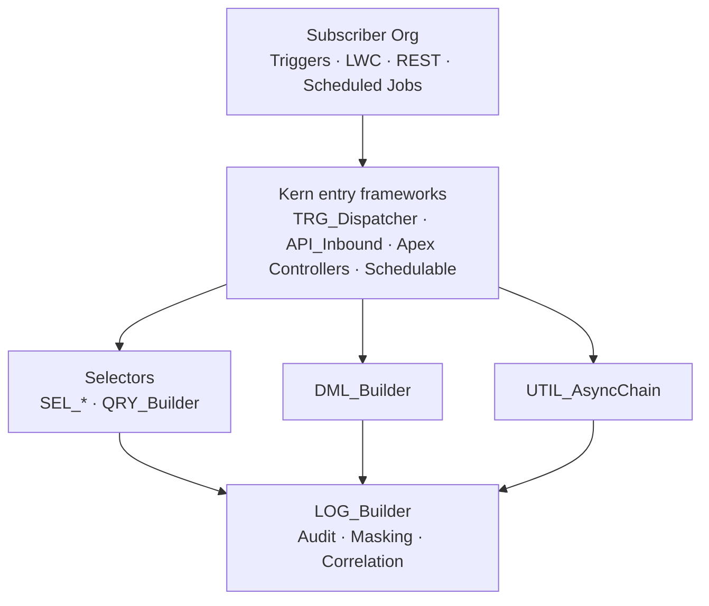

# KernDX

[](./docs/Code%20Conventions%20-%20Guide.md)
[](./RELEASE-PROVENANCE.json)
[](./LICENSE)

Ship Apex and LWC features in a fraction of the time.

KernDX gives Salesforce teams a **complete, integrated framework** — so you focus on business logic, not infrastructure. One managed package replaces 6-8 separate libraries: triggers, queries, DML, web services, async processing, validation, logging, data masking, LWC components, and the CI tooling to keep it all clean.

**Why teams adopt it**

- **One stack, one convention** — every layer follows the same `TRG_*` / `SEL_*` / `DML_*` / `LOG_*` prefixes. What you learn for triggers transfers to queries and DML.
- **Default-on safety** — every query and write runs in `USER_MODE` (FLS + CRUD enforced on read AND write); 100% per-file Apex coverage; 95% LWC; per-call bypasses audited.
- **AI-friendly out of the box** — [`AGENTS.md`](./AGENTS.md) + [canonical conventions](./docs/Code%20Conventions%20-%20Guide.md) ship at the repo root, so Claude Code, Cursor, Cline, and similar tools generate convention-compliant code from day one.
- **Source-available under BSL 1.1, no vendor lock-in** — every file is in this repo. Three deployment paths: continue using the managed package, deploy as source directly, or repackage under your own namespace using the included namespace-swap toolkit.

This repository is the **public release repo** for KernDX. `main` is fast-forward-only and tracks subscriber package version `1.0.0-121` at this snapshot.

## Architecture at a glance



Every read goes through a selector (FLS-enforced); every write goes through DML_Builder (USER_MODE by default); every cross-transaction chain goes through AsyncChain (correlation IDs threaded); every framework call emits to LOG_Builder. One mental model across the stack.

## Why so opinionated?

100% Apex coverage. 95% LWC coverage. Default-on FLS + CRUD on every read and write. PMD-clean code as a PR gate. Naming prefixes enforced by scanner. We know — it sounds like a lot.

It exists because frameworks decay. Constraints that feel restrictive at month one are the only thing keeping framework guarantees true at month thirty-six, after a dozen contributors, three "we'll come back and fix this" detours, and one Salesforce release with a breaking change. Default-on means a tired engineer at 11pm can't accidentally ship a bypass; PR-gates mean a new hire can't accidentally normalize one.

The constraints are deliberate, documented, and ship as enforceable gates — not gentle suggestions. If you adopt the framework, you get the discipline as a side effect.

## Install paths

|   | **Path 1 — Managed package** | **Path 2 — Repackage under your namespace** | **Path 3 — CI tooling only** |
| --- | --- | --- | --- |
| **Who it's for** | Salesforce admins / developers adding KernDX to an existing org. | Teams that want to embed KernDX inside their own managed package. | Teams that want the KernDX CI pipeline without the framework itself. |
| **What gets installed** | The `kern` managed package at `1.0.0-121`. All code lives under the `kern` namespace. | Your own managed package built from KernDX source under *your* namespace. | ESLint plugin + 2 PMD rulesets + 11 GitHub Actions workflow templates. Zero framework code. |
| **Install command** | `sf package install --package 04tfj000000JN0vAAG --target-org <alias>` (04t in `RELEASE-PROVENANCE.json`). | `node bin/swap-namespace.js <your-namespace>` then build your own package. | Download `KernDX-1.0.0-121-pipeline.zip` → `unzip + (cd .kerndx-pipeline/pipeline && npm ci --omit=dev) + ./.kerndx-pipeline/bin/kerndx init`. |
| **When to choose** | You want the framework as a managed dependency you can swap in days, not weeks. | You're building a managed package and want KernDX inside it as *your* code. | You don't want the framework but you want the conventions enforced in your CI. |
| **Full guide** | [Installation — Path 1](./docs/Installation.md#path-1-install-the-kerndx-managed-package) | [Installation — Path 2](./docs/Installation.md#path-2-repackage-under-your-own-namespace) | [Installation — Path 3](./docs/Installation.md#path-3-ci-tooling-only) · preview [9 workflow examples](./examples/workflows/) |

### Evaluate in a scratch org (no managed-package dependency)

[](https://githubsfdeploy.herokuapp.com/?owner=JVB-Consulting&repo=kerndx)

One click deploys `force-app/` source into a scratch or sandbox org you nominate, so you can poke at the framework before deciding which install path is right for you. Source deploys are *not* a supported install path — they ship without the managed-package lifecycle guarantees — but they are the fastest way to read real code in a real org.

## Quick start

> **Developer-focused.** This Quick Start is for contributors cloning the source tree to run tests or contribute. **Subscribers installing the framework**: see [Installation — Path 1](./docs/Installation.md#path-1-install-the-kerndx-managed-package) — you do not need to clone the repo.

```bash
git clone https://github.com/JVB-Consulting/kerndx.git
cd kerndx

# Node 22 required — .nvmrc pins it.
nvm install 22
nvm use

npm ci

# Required for release tests against a subscriber org.
export SF_SUBSCRIBER_ORG_ALIAS=<your-subscriber-scratch-org-alias>

# Run the LWC Jest suite (scoped to force-app/).
npm run test:unit

# Run the Apex tests against your subscriber org.
npm run release:phase2
```

### Other test entry points

| Script | Scope |
| --- | --- |
| `npm run test:unit` | LWC component tests under `force-app/` (default Jest suite). |
| `npm run test:scanner` | KernDX ESLint plugin rule tests (`scanner/eslint-plugin-kerndx/__tests__/`). |
| `npm run test:release` | Release-testing runner unit tests (requires `SF_SUBSCRIBER_ORG_ALIAS`). |
| `npm run test:pipeline` | Pipeline native-test suite (`cd pipeline && npm ci --omit=dev && npm test`). Clones from this repo automatically skip the test files that depend on internal-only `subscriber-naming` fixtures; the wrapper logs the skipped files and runs the remainder. |
| `npm run test:e2e` | Playwright smoke. Run `npx playwright install --with-deps` once first. Requires `SF_SUBSCRIBER_ORG_ALIAS`. |

### Environment variables by script

| Variable | Required for | Notes |
| --- | --- | --- |
| `SF_SUBSCRIBER_ORG_ALIAS` | `release:phase2`, `test:release`, `test:e2e` | sf-cli alias for the subscriber scratch/sandbox org the release tests target. The runner fails fast with a clear message if unset. |
| `KERN_DEV_ORG` | `build:package`, `setup:scratch-org`, `scan:flow-refs`, `evaluate:coverage`, `docs:build` | sf-cli alias for your dev scratch org. Only needed if you run the dev-tooling scripts under `scripts/` — not required for any of the test entry points above. |
| `ICAPEXDOC_HOME` | `docs:build` (optional) | Absolute path to your local IcApexDoc install (see [release page](https://github.com/SCWells72/IcApexDoc/releases)). Only needed to regenerate the Apex reference docs locally. |

## Where to go next

- **Looking for docs that match a specific installed version?** This README and the docs under `docs/` always track the latest release (currently `1.0.0-121`). Every release is preserved as a git tag `vX.Y.Z-N` — browse the [Tags page](https://github.com/JVB-Consulting/kerndx/tags) (or [Releases](https://github.com/JVB-Consulting/kerndx/releases) for richer per-release notes) and check out the matching tag (e.g. `git checkout v1.0.0-121`). Every file in this repository — README, install commands, API reference, Strategic Guides — is frozen at the state of that release.
- [**Release Notes — Kern 1.0**](./release-notes/Release%20Notes%20-%20Kern%201.0.md) — what shipped in v1.0, grouped by capability with migration notes. **Read this first if you are evaluating an upgrade** (the top-level [CHANGELOG.md](./CHANGELOG.md) is a sequential per-build log for diagnostic use — release notes are the subscriber-facing summary).
- [Documentation hub](./docs/README.md) — learning paths, Fast Starts, Strategic Guides, Apex reference.
- [Installation guide](./docs/Installation.md) — install + namespace-swap workflow.
- [Fast Starts](./docs/) — 12 task-oriented guides (Selectors, DML, Test Data, Logging, Feature Flags, Outbound APIs, Inbound APIs, Trigger Actions, Custom Validations, Async Processing, E2E Testing, Code Scanning).
- [Module guides](./docs/) — long-form reference per framework area (LWC, Security, Triggers, Web Services, Async, Validation, DML, Selectors, Logging, Utilities, DTOs, Objects & Metadata, Code Scanning, E2E Testing).
- [Apex reference](./docs/reference/) — auto-generated ApexDoc + LWC reference.
- [Strategic Guides](./docs/) — adoption decisions, architecture rationale, operations, personas, glossary, metrics.
- [Code Conventions](./docs/Code%20Conventions%20-%20Guide.md) — canonical code-style + framework rules.
- [Workflow examples](./examples/workflows/) — pre-rendered versions of the 9 GitHub Actions workflows that the kerndx-pipeline distribution ships.

## Contributing

**v1.0:** bug reports and feature requests are welcome via [GitHub Issues](https://github.com/JVB-Consulting/kerndx/issues/new/choose). External PRs are **not** currently accepted at this stage of the project — each release overwrites the branch state, so a PR merged here would be replaced on the next release. The issue-first workflow is the supported path. See [`CONTRIBUTING.md`](./CONTRIBUTING.md) for the full v1.0 contribution model + rationale.

Security vulnerabilities: do **not** open a public issue. See [the security policy](./SECURITY.md) for the responsible-disclosure process.

## Need a hand?

Paid enterprise support is available for teams that want a faster path on top of the source-available framework:

- **Adoption consulting** — namespace-swap planning, repackaging strategy, CI integration.
- **Customisation** — bespoke selectors, validation rules, async chains, or LWC components against the framework conventions.
- **Audit + review** — code-conventions audit, coverage-theatre detection, performance baseline review.

Contact: `jason@jvb-consulting.io`. The framework itself is and remains [BSL 1.1](./LICENSE) source-available with a four-year clock to Apache 2.0; the support engagement is the optional fast path, not a gating dependency.

## Licensing

- **Framework (Apex, LWC, docs, scripts, metadata)** — [Business Source License 1.1](./LICENSE) — source-available, with a four-year clock to Apache 2.0 (the Change License).
- **Standalone CI pipeline tooling under `pipeline/`** — [MIT License](./pipeline/LICENSE), licensed separately so subscribers and CI vendors can adopt it without inheriting BSL terms.
- **Third-party-derived files** — KernDX includes Apache 2.0 derivatives (apex-lang, apex-trigger-actions-framework), MIT derivatives (ApexLogger, SObjectIndex, JsonPath), and CC0-1.0 derivatives (streaming-monitor). Each derived file's header carries an SPDX-License-Identifier and upstream attribution; [`NOTICES.md`](./NOTICES.md) is the per-upstream-project attribution document; the [`LICENSE`](./LICENSE) carve-out section enumerates the Apache-2.0 / MIT files (CC0-1.0 derivatives are relicensed under BSL 1.1 since CC0 imposes no requirement). Full upstream license texts ship under [`LICENSES/`](./LICENSES/).

## AI coding assistants

If you're an AI coding assistant operating in this repository, read [`AGENTS.md`](./AGENTS.md) and [the code conventions](./docs/Code%20Conventions%20-%20Guide.md) before generating code. They define the framework rules + style that override generic defaults.
