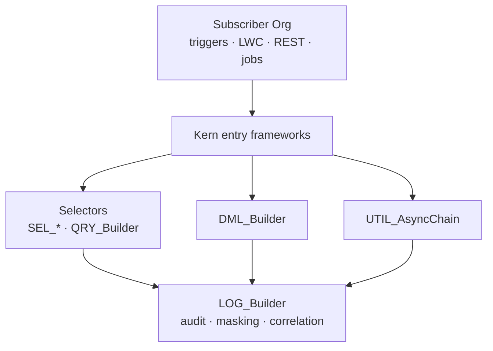

# KernDX

[](./docs/Code%20Conventions%20-%20Guide.md)
[](./RELEASE-PROVENANCE.json)
[](./LICENSE)
[](https://docs.jvb-consulting.io/)

📚 **[Browse the documentation site](https://docs.jvb-consulting.io/)**: the same Fast Starts, Strategic Guides, and Apex reference under `docs/`, rendered and searchable.

**Every Salesforce framework your team keeps rebuilding, in one Apex & LWC library.**

Spend your team on the features that move the business, not on rebuilding the trigger framework, logging, security, and the rest of the plumbing every Salesforce org writes anyway. One managed package, secure by default, public source on GitHub.

`105 global API classes` · `190 production classes` · `68 LWC components` · `3,891 tests` · `100% Apex / 95% LWC coverage`

**Most Salesforce open-source ships a library and stops there. KernDX ships the library plus the onboarding, CI, and guardrails that keep it consistent.**

One managed package, but not all-or-nothing: switch on the parts that fit your situation, and the rest is there the day you need it.

- **One core, one convention.** Triggers, queries, DML, APIs, async, validation, logging, data masking, and LWC all run on one consistent path with shared `TRG_*` / `SEL_*` / `DML_*` / `LOG_*` naming. Learn one layer and you know the rest.
- **Onboarding in the box.** Docs, Fast Starts, [`AGENTS.md`](./AGENTS.md), and [canonical conventions](./docs/Code%20Conventions%20-%20Guide.md) mean a new hire (or an AI assistant like Claude Code or Cursor) writes convention-compliant code on day one.
- **CI in the box.** PMD rulesets, an ESLint plugin, secret scanning, and coverage gates that drop into your pipeline.
- **Guardrails built in.** Reads and writes run FLS-safe by default (FLS = field-level security). 100% Apex / 95% LWC coverage is enforced at every release. Bypasses are audit-logged with the reason the caller gave, so a security review can start from a query.
- **Yours to keep.** Source-available under BSL 1.1, with no lock-in: run the managed package, repackage under your own namespace, or run the source yourself.

## What it prevents

What happens when…

- the trigger framework you copied into fifteen orgs has drifted in all fifteen, and the bug only reproduces in the one you didn't touch?
- a query runs in system mode, skips the user's field permissions, and the security reviewer asks you to prove it didn't, with no single place to look?
- a clean deploy finishes before the test suite that's supposed to guard it does, so the suite stops being a gate and starts being a formality?
- the AI assistant writes Apex that compiles, passes review, and ignores every naming and bypass rule your team agreed on last quarter?

**KernDX makes each one hard to reach:** permissions on by default, one trigger path every org shares, every shortcut logged with the reason it was taken, and a standards file your AI assistant actually reads before it writes.

## Came here looking for…

Each has a Fast Start you can finish in under 30 minutes. Jump to the one you came for:

- **Trigger framework.** Metadata-driven, with an audit-logged bypass, a 4-level kill switch (a master off-switch you can flip in an incident without a deployment), and recursion control. [Fast Start →](./docs/Fast%20Start%20-%20Trigger%20Actions.md)
- **SOQL query builder.** FLS-enforced by default, with an audited bypass, a fluent API, and subclassing. [Fast Start →](./docs/Fast%20Start%20-%20Selectors.md)
- **DML wrapper.** Runs in `USER_MODE` by default (the current user's read/write permissions and record sharing are enforced). Adds transactional batching, async DML, and a dependency graph. [Fast Start →](./docs/Fast%20Start%20-%20DML.md)
- **Outbound HTTP.** Retry, a circuit breaker (after repeated failures it stops calling a failing system for a cool-off, then resumes), idempotency keys (a key on the request so the same call isn't run twice), and a dead-letter queue (calls that fail after every retry are set aside for inspection, not silently lost). [Fast Start →](./docs/Fast%20Start%20-%20Outbound%20APIs.md)
- **Inbound REST.** A two-class routing pattern, DTO marshalling (a small class that converts itself to and from the JSON payload), and a body-hash 409 on replay (a duplicate request returns the first result, but a repeat that reuses the key with a different body is rejected). [Fast Start →](./docs/Fast%20Start%20-%20Inbound%20APIs.md)
- **Logging.** Platform-event transport, with correlation IDs threaded across triggers, async, and HTTP (one tracking ID that follows a single user action through every step). [Fast Start →](./docs/Fast%20Start%20-%20Logging.md)
- **Async orchestration.** Chained Queueables, shared state, finalizer recovery, and a Chain Monitor LWC. [Fast Start →](./docs/Fast%20Start%20-%20Async%20Processing.md)
- **Test data factory.** A builder pattern, parent-child wiring, and DML-free selector mocks. [Fast Start →](./docs/Fast%20Start%20-%20Test%20Data.md)
- **Feature flags.** Metadata-driven, evaluated per user and profile, callable from Apex, Flow, and LWC, with pluggable strategies. [Fast Start →](./docs/Fast%20Start%20-%20Feature%20Flags.md)
- **Custom validations.** Metadata-driven, with a shadow mode (runs watch-only in production: logs what it would do but doesn't block yet), a 3-level bypass, and zero Apex. [Fast Start →](./docs/Fast%20Start%20-%20Custom%20Validations.md)
- **Resilient callouts.** Retry, exponential backoff, and a circuit breaker on any callout, with no boilerplate. [Fast Start →](./docs/Fast%20Start%20-%20Resilience.md)
- **Secure data access.** `USER_MODE` CRUD/FLS enforced on every read and write by default (CRUD = object create/read/update/delete permissions). [Fast Start →](./docs/Fast%20Start%20-%20Security.md)
- **Data masking.** Write-time field redaction on a configurable field set, plus a Data Masking Advisor to scan, deploy config, and inventory regulated fields. [Fast Start →](./docs/Fast%20Start%20-%20Data%20Masking.md)
- **LWC components.** A base class with toasts, Apex calls, navigation, and logging wired in. [Fast Start →](./docs/Fast%20Start%20-%20LWC.md)

→ Comparing against alternatives? [Choosing a Framework](./docs/Strategic%20Guide%20-%20Choosing%20a%20Framework.md) covers head-to-head trade-offs vs `taf`, `fflib`, `rflib`, `nebula-logger`, `apex-libra`, the [Apex Fluently](https://github.com/beyond-the-cloud-dev) libraries, and `fflib-mocks`.

KernDX is **one managed package that replaces a dozen separate libraries**: the SOQL query builder, DML wrapper, trigger framework, async orchestration, REST APIs (inbound + outbound), feature flags, validation, logging, data masking, test data factory, LWC components, and the CI tooling to keep it all clean. You focus on business logic, not infrastructure.

This repository is the **public release repo** for KernDX. `main` is fast-forward-only and tracks subscriber package version `1.4.0-2` at this snapshot.

## Built for AI-assisted development

Your AI assistant gets the standards before it writes. KernDX ships its AI context as plain files in the public repo, with nothing to install, so Claude, Cursor, Copilot, or Gemini generate Apex and LWC that follow the framework (the naming, the secure defaults, the audited-bypass rule) instead of inventing their own.

- [`AGENTS.md`](./AGENTS.md) sits at the repo root: the tool-neutral on-ramp that Claude Code, Cursor, Codex, and Cline read first.
- [AI Agent Instructions](./docs/AI%20Agent%20Instructions.md) is the complete code-generation reference. Copy it into the rules file your tool auto-loads (`AGENTS.md`, `CLAUDE.md`, or `.cursorrules`), or reference it so a `git pull` keeps it current.
- Those same standards ship as PMD rulesets and an ESLint plugin, so what the assistant follows is also enforced where you already work: inline in VS Code or IntelliJ / Illuminated Cloud, and gated on every pull request in CI.

## Ideas worth taking

Design decisions worth reading even if you never adopt KernDX. Each links to the guide that explains the thinking:

- **Why a "safe to retry" key isn't enough.** A retry carrying different data than the first try is rejected, not replayed, so a changed request can't silently overwrite the original. [Read the decision →](./docs/Fast%20Start%20-%20Inbound%20APIs.md#idempotency)
- **Why a logging tool must avoid logging about itself.** When the thing recording events is itself event-driven, naive logging loops forever. KernDX detects that case and writes the record directly. [Read the decision →](./docs/Logging%20-%20Guide.md#logging-inside-platform-event--change-event-triggers)
- **Why an empty filter should match nothing, not everything.** An empty "only include these" list returns nothing; an empty "exclude these" list returns everything. That way a filter bug can't quietly scan your whole table. [Read the decision →](./docs/Selectors%20-%20Guide.md#handle-null-and-empty-collections)
- **Why hiding card numbers takes more than pattern-matching.** KernDX matches the shape loosely, then runs the card-number checksum, so real cards get hidden while order numbers and dates are left alone. [Read the decision →](./docs/Data%20Masking%20-%20Guide.md#modes)
- **Why the framework looks for your version of a class first.** It checks your project for a class before falling back to its own, so "write your own and it wins" becomes a built-in way to customise, with nothing to register. [Read the decision →](./docs/Code%20Conventions%20-%20Guide.md#type-resolution)
- **Why feature flags decide like an access list.** Each rule answers yes, no, or "not my call", and that third answer lets you stack "block these, then allow those" rules in order without them fighting. [Read the decision →](./docs/Feature%20Flags%20-%20Guide.md#evaluation-order)

## Why "KernDX"?

*Kern*, for kernel: a dependable core your Apex and LWC run *through*, with every read, write, and async hop on one consistent, access-controlled path. *DX*, for developer experience: the docs, conventions, AI-agent onboarding, and CI in the same box. It's the core of *your* codebase, not a replacement for the Salesforce platform. The platform is still the platform.

And like a kernel, it's not all-or-nothing. Switch on the parts that fit your situation (just the query layer today, the trigger framework when you need it, logging or data masking when you're ready) knowing the rest is there the day you do. You adopt at your own pace; nothing forces you to take the whole thing to get value from one piece.

## Architecture at a glance



Every read goes through a selector (FLS-enforced). Every write goes through DML_Builder (USER_MODE by default). Every cross-transaction chain goes through AsyncChain (correlation IDs threaded). Every framework call emits to LOG_Builder. One mental model across the stack.

## Why so opinionated?

100% Apex coverage. 95% LWC coverage. Default-on FLS + CRUD on every read and write. PMD-clean code as a PR gate. Naming prefixes enforced by scanner. We know: it sounds like a lot.

It exists because frameworks decay. Constraints that feel restrictive at month one are the only thing keeping framework guarantees true at month thirty-six, after a dozen contributors, three "we'll come back and fix this" detours, and one Salesforce release with a breaking change. Default-on means a tired engineer at 11pm can't accidentally ship a bypass; PR-gates mean a new hire can't accidentally normalize one.

The constraints are deliberate, documented, and ship as enforceable gates, not gentle suggestions. If you adopt the framework, you get the discipline as a side effect.

## Install paths

|   | **Path 1: Managed package** | **Path 2: Repackage under your namespace** | **Path 3: CI tooling only** |
| --- | --- | --- | --- |
| **Who it's for** | Salesforce admins / developers adding KernDX to an existing org. | Teams that want to embed KernDX inside their own managed package. | Teams that want the KernDX CI pipeline without the framework itself. |
| **What gets installed** | The `kern` managed package at `1.4.0-2`. All code lives under the `kern` namespace. | Your own managed package built from KernDX source under *your* namespace. | ESLint plugin + 2 PMD rulesets + 10 GitHub Actions workflow templates. Zero framework code. |
| **Install command** | `sf package install --package 04tfj000000MlrVAAS --target-org <alias>` (04t in `RELEASE-PROVENANCE.json`). | `node bin/swap-namespace.js <your-namespace>` then build your own package. | Download `KernDX-1.4.0-2-pipeline.zip` → `unzip + (cd .kerndx-pipeline/pipeline && npm ci --omit=dev) + ./.kerndx-pipeline/bin/kerndx init`. |
| **When to choose** | You want the framework as a managed dependency you can swap in days, not weeks. | You're building a managed package and want KernDX inside it as *your* code. | You don't want the framework but you want the conventions enforced in your CI. |
| **Full guide** | [Installation, Path 1](./docs/Installation.md#path-1-install-the-kerndx-managed-package) | [Installation, Path 2](./docs/Installation.md#path-2-repackage-under-your-own-namespace) | [Installation, Path 3](./docs/Installation.md#path-3-ci-tooling-only) · preview [9 workflow examples](./examples/workflows/) |

### Evaluate in a scratch org (no managed-package dependency)

[](https://githubsfdeploy.herokuapp.com/?owner=JVB-Consulting&repo=kerndx)

One click deploys `force-app/` source into a scratch or sandbox org you nominate, so you can poke at the framework before deciding which install path is right for you. Deploying the source directly is a genuine option (the same unmanaged delivery you'd use to own the code outright), but it ships without the managed-package upgrade lifecycle, so it isn't the recommended way to run KernDX day-to-day: you'd reconcile changes by hand on each update instead of installing a new package version. It is the fastest way to read real code in a real org, and your assurance that you can always run the framework yourself.

## Quick start

> **Developer-focused.** This Quick Start is for contributors cloning the source tree to run tests or contribute. **Installing the framework into your org?** See [Installation, Path 1](./docs/Installation.md#path-1-install-the-kerndx-managed-package). You do not need to clone the repo.

```bash
git clone https://github.com/JVB-Consulting/kerndx.git
cd kerndx

# Node 22 required — .nvmrc pins it.
nvm install 22
nvm use

npm ci

# Required for release tests against a subscriber org.
export SF_SUBSCRIBER_ORG_ALIAS=<your-subscriber-scratch-org-alias>

# Run the LWC Jest suite (scoped to force-app/).
npm run test:unit

# Run the Apex tests against your subscriber org.
npm run release:phase2
```

### Other test entry points

| Script | Scope |
| --- | --- |
| `npm run test:unit` | LWC component tests under `force-app/` (default Jest suite). |
| `npm run test:scanner` | KernDX ESLint plugin rule tests (`scanner/eslint-plugin-kerndx/__tests__/`). |
| `npm run test:release` | Release-testing runner unit tests (requires `SF_SUBSCRIBER_ORG_ALIAS`). |
| `npm run test:pipeline` | Pipeline native-test suite (`cd pipeline && npm ci --omit=dev && npm test`). Clones from this repo automatically skip the test files that depend on internal-only `subscriber-naming` fixtures; the wrapper logs the skipped files and runs the remainder. |
| `npm run test:e2e` | Playwright smoke. Run `npx playwright install --with-deps` once first. Requires `SF_SUBSCRIBER_ORG_ALIAS`. |

### Environment variables by script

| Variable | Required for | Notes |
| --- | --- | --- |
| `SF_SUBSCRIBER_ORG_ALIAS` | `release:phase2`, `test:release`, `test:e2e` | sf-cli alias for the subscriber scratch/sandbox org the release tests target. The runner fails fast with a clear message if unset. |
| `KERN_DEV_ORG` | `build:package`, `setup:scratch-org`, `scan:flow-refs`, `evaluate:coverage`, `docs:build` | sf-cli alias for your dev scratch org. Only needed if you run the dev-tooling scripts under `scripts/`, not required for any of the test entry points above. |
| `ICAPEXDOC_HOME` | `docs:build` (optional) | Absolute path to your local IcApexDoc install (see [release page](https://github.com/SCWells72/IcApexDoc/releases)). Only needed to regenerate the Apex reference docs locally. |

## Where to go next

- **Looking for docs that match a specific installed version?** This README and the docs under `docs/` always track the latest release (currently `1.4.0-2`). Every release is preserved as a git tag `vX.Y.Z-N`. Browse the [Tags page](https://github.com/JVB-Consulting/kerndx/tags) (or [Releases](https://github.com/JVB-Consulting/kerndx/releases) for richer per-release notes) and check out the matching tag (e.g. `git checkout v1.4.0-2`). Every file in this repository (README, install commands, API reference, Strategic Guides) is frozen at the state of that release.
- [**Release Notes: Kern 1.1**](./release-notes/Release%20Notes%20-%20Kern%201.1.md): what's new since v1.0, grouped by capability, with upgrade notes. **Read this first if you are evaluating an upgrade.**
- [**Release Notes: Kern 1.0**](./release-notes/Release%20Notes%20-%20Kern%201.0.md): the comprehensive feature reference for the framework 1.1 builds on, grouped by capability. (The top-level [CHANGELOG.md](./CHANGELOG.md) is a sequential per-build log for diagnostic use; the release notes are the subscriber-facing summary.)
- [Documentation hub](./docs/README.md): learning paths, Fast Starts, Strategic Guides, Apex reference.
- [Installation guide](./docs/Installation.md): install + namespace-swap workflow.
- [Fast Starts](./docs/): 16 task-oriented guides (Selectors, DML, Test Data, Security, Data Masking, Logging, Feature Flags, Outbound APIs, Resilience, Inbound APIs, Trigger Actions, Custom Validations, Async Processing, LWC, E2E Testing, Code Scanning).
- [Module guides](./docs/): long-form reference per framework area (LWC, Security, Data Masking, Triggers, Web Services, Resilience, Async, Validation, DML, Selectors, Logging, Feature Flags, Utilities, Test Data, DTOs, Objects & Metadata, Code Scanning, E2E Testing).
- [Apex reference](./docs/reference/): auto-generated ApexDoc + LWC reference.
- [Strategic Guides](./docs/): adoption decisions, architecture rationale, operations, personas, glossary, metrics.
- [Code Conventions](./docs/Code%20Conventions%20-%20Guide.md): canonical code-style + framework rules.
- [Workflow examples](./examples/workflows/): pre-rendered previews of 9 of the 10 GitHub Actions workflow templates the kerndx-pipeline distribution scaffolds.

## Contributing

Bug reports and feature requests are welcome via [GitHub Issues](https://github.com/JVB-Consulting/kerndx/issues/new/choose). External PRs aren't supported yet: each release regenerates this published repository, so a PR merged here would be overwritten on the next release. The issue-first workflow is the supported path. See [`CONTRIBUTING.md`](./CONTRIBUTING.md) for the full contribution model + rationale.

Security vulnerabilities: do **not** open a public issue. See [the security policy](./SECURITY.md) for the responsible-disclosure process.

## Need a hand?

Paid enterprise support is available for teams that want a faster path on top of the source-available framework:

- **Adoption consulting:** namespace-swap planning, repackaging strategy, CI integration.
- **Customisation:** bespoke selectors, validation rules, async chains, or LWC components against the framework conventions.
- **Audit + review:** code-conventions audit, coverage-theatre detection, performance baseline review.

Contact: `jason@jvb-consulting.io`. The framework itself is and remains [BSL 1.1](./LICENSE) source-available with a four-year clock to Apache 2.0; the support engagement is the optional fast path, not a gating dependency.

## Licensing

- **Framework (Apex, LWC, docs, scripts, metadata):** [Business Source License 1.1](./LICENSE), source-available, with a four-year clock to Apache 2.0 (the Change License).
- **Standalone CI pipeline tooling under `pipeline/`:** [MIT License](./pipeline/LICENSE), licensed separately so teams and CI vendors can adopt it without inheriting BSL terms.
- **Third-party-derived files:** KernDX includes Apache 2.0 derivatives (apex-lang, apex-trigger-actions-framework), MIT derivatives (ApexLogger, SObjectIndex, JsonPath), BSD 3-Clause derivatives (Apex-Util describe + unit-of-work utilities), and CC0-1.0 derivatives (streaming-monitor). Each derived file's header carries an SPDX-License-Identifier and upstream attribution; [`NOTICES.md`](./NOTICES.md) is the per-upstream-project attribution document; the [`LICENSE`](./LICENSE) carve-out section enumerates the Apache-2.0 / MIT / BSD-3-Clause files (CC0-1.0 derivatives are relicensed under BSL 1.1 since CC0 imposes no requirement). Full upstream license texts ship under [`LICENSES/`](./LICENSES/).

## AI coding assistants

If you're an AI coding assistant operating in this repository, read [`AGENTS.md`](./AGENTS.md) and [the code conventions](./docs/Code%20Conventions%20-%20Guide.md) before generating code. They define the framework rules + style that override generic defaults.
