# Objects & Metadata - Guide

**Framework:** KernDX
**Package Type:** Managed Package

**Target Audience:**

- **Developers** - Understanding custom objects, metadata types, and configuration patterns for framework implementation
- **Architects** - Designing solutions leveraging framework objects, custom settings, and metadata-driven configuration
- **Business Analysts** - Understanding data model, configuration options, and cross-framework relationships

---

## What problem does this solve?

Every part of KernDX is steered by data you can see and change: configuration records that turn behaviour on, log records that capture what happened, and a handful of tracking objects that record API calls and background jobs. When you need to wire something up or look something up, you need to know which record holds it.

This guide is the map of all that data. It tells you which object or metadata type stores what, which field controls which behaviour, and how the objects connect across the framework.

Use it when you need to look up a field, wire up a configuration record, or understand how one framework's data feeds another. Developers use it as a field reference; architects use it to see the whole data model; analysts use it to find the records they configure.

## Mental model

Think of these records as the framework's control panel and flight recorder. The custom metadata and custom settings are the dials and switches you turn to change how the framework behaves; the custom objects are the recorders that capture what happened (every log line, every API call, every background job). You change behaviour by editing a record, not by editing code, and you read back what the framework did by querying a record.

## Use this when

- You need to configure the framework: register a trigger action, add a validation rule, set up an API endpoint, or define a feature flag. All of these are records, not code.
- You want to look up an exact field name, type, or default before you write a query or build a record.
- You are mapping how the frameworks connect, for example how a failed API call becomes a retry record, or how every framework feeds the same log object.
- You want an audit trail you can query: which API calls ran, what was logged, which background jobs executed.

## Don't use this when

- A plain Salesforce validation rule or formula already does the check you need. The custom validation objects here earn their place when you need cross-object checks, field-to-field comparisons, or a rule you can switch off under a condition; for a single-field rule on one object, the built-in feature is simpler.
- You only need a one-off scheduled job and never plan to change it declaratively. Salesforce's own scheduling is enough; `ScheduledJob__c` earns its place when you want admins to manage schedules as records.
- You are looking for the behaviour itself rather than where it is stored. The logic lives in the Apex classes documented in the per-framework guides; this guide is the data-model reference those guides point back to.

## Quick Start

Two tasks come up more than any others: adding behaviour to an object's trigger, and scheduling a recurring job. Both are done by creating configuration records, not by editing code. Here is how each one works.

**Configure a trigger action via custom metadata:**

You want to run some Apex logic when records on an object are saved. Create a `TriggerSetting__mdt` record for your object, then create a `TriggerAction__mdt` child record that points
to your handler class. The framework finds and runs your handler automatically when the trigger fires, so you never edit the trigger file itself.

```text
TriggerSetting__mdt:
  SObjectType__c = Foobar__c (EntityDefinition)

TriggerAction__mdt:
  ApexClassName__c = 'TRG_SetFoobarDefaults'
  TriggerSetting__c = [above record]
  Event__c = 'Before Insert'
  Order__c = 1
```

**Schedule a recurring job via ScheduledJob__c:**

You want a class to run on a schedule, for example a nightly clean-up. Create a `ScheduledJob__c` record with a cron expression (the time pattern) and the class name, then set `IsActive__c = true`. The framework schedules the job for you.

```apex
ScheduledJob__c job = new ScheduledJob__c();
job.SchedulerName__c = 'Nightly Log Purge';
job.ClassName__c = 'SCHED_PurgeRecords';
job.CronExpression__c = '0 0 2 * * ?';
job.Parameters__c = new DTO_NameValues(new Map<String, String>{'objectName' => 'LogEntry__c', 'minimumNumberOfDays' => '90'}).serialize();
job.IsActive__c = true;
insert job;
```

For deeper coverage, continue reading the sections below.

---

## Table of Contents

<details>
<summary>Expand</summary>

1. [What problem does this solve?](#what-problem-does-this-solve)
2. [Mental model](#mental-model)
3. [Use this when](#use-this-when)
4. [Don't use this when](#dont-use-this-when)
5. [Quick Start](#quick-start)
6. [Quick Navigation](#quick-navigation)
7. [What are the building blocks?](#what-are-the-building-blocks)
8. [How is the data model laid out?](#how-is-the-data-model-laid-out)
    - [Custom Objects](#custom-objects)
    - [Custom Settings](#custom-settings)
    - [Platform Events](#platform-events)
    - [Custom Metadata Types](#custom-metadata-types)
9. [What does each framework store?](#what-does-each-framework-store)
    - [Logging Framework](#logging-framework)
        - [Architecture Diagram](#architecture-diagram)
        - [Objects](#objects)
    - [Trigger Action Framework](#trigger-action-framework)
        - [Architecture Diagram](#architecture-diagram-1)
        - [Objects](#objects-1)
    - [Validation Framework](#validation-framework)
        - [Objects](#objects-2)
    - [Web Service Framework](#web-service-framework)
        - [Architecture Diagram](#architecture-diagram-2)
        - [Objects](#objects-3)
    - [Feature Management Framework](#feature-management-framework)
        - [Architecture Diagram](#architecture-diagram-3)
        - [Objects](#objects-4)
    - [Asynchronous Operations Framework](#asynchronous-operations-framework)
        - [Architecture Diagram](#architecture-diagram-4)
        - [Objects](#objects-5)
    - [Data Management & Configuration](#data-management--configuration)
        - [Objects](#objects-6)
10. [How do the frameworks connect?](#how-do-the-frameworks-connect)
    - [Framework Integration Points](#framework-integration-points)
    - [Key Integration Patterns](#key-integration-patterns)
11. [How do these objects work together?](#how-do-these-objects-work-together)
    - [Pattern 1: Metadata-Driven Trigger with Logging](#pattern-1-metadata-driven-trigger-with-logging)
    - [Pattern 2: API Integration with Retry Logic](#pattern-2-api-integration-with-retry-logic)
    - [Pattern 3: Feature Flag with Multiple Strategies](#pattern-3-feature-flag-with-multiple-strategies)
12. [How do I test this?](#how-do-i-test-this)
13. [What mistakes should I avoid?](#what-mistakes-should-i-avoid)
14. [What are the recommended practices?](#what-are-the-recommended-practices)
15. [Related Documentation](#related-documentation)
16. [Appendix A: Mermaid ERD](#appendix-a-mermaid-erd)

</details>

---

## Quick Navigation

| I am a...     | I need to...                      | Go to...                                                        |
|---------------|-----------------------------------|-----------------------------------------------------------------|
| **Architect** | Understand the data model         | [How is the data model laid out?](#how-is-the-data-model-laid-out) |
| **Architect** | See cross-framework relationships | [How do the frameworks connect?](#how-do-the-frameworks-connect) |
| **Developer** | Find object field references      | [What does each framework store?](#what-does-each-framework-store) |
| **Developer** | See integration patterns          | [How do these objects work together?](#how-do-these-objects-work-together) |
| **Analyst**   | Configure trigger settings        | [Trigger Action Framework](#trigger-action-framework)           |
| **Analyst**   | Configure validation rules        | [Validation Framework](#validation-framework)                   |
| **Analyst**   | Configure API settings            | [Web Service Framework](#web-service-framework)                 |
| **Analyst**   | Configure feature flags           | [Feature Management Framework](#feature-management-framework)   |

---

## What are the building blocks?

These records hold configuration, logs, and operational data only. They do not contain business logic: that lives in the Apex classes documented in the other guides.

> **Package Data Model:** 10 custom objects, 15 custom metadata types, 57 pre-built metadata records, and 1 platform event.
> These objects underpin the Logging, Trigger, Web Service, Feature Flag, Async, and Validation frameworks.

> For current framework statistics, see [Metrics](Strategic%20Guide%20-%20Metrics.md).

The package groups its data into four kinds of building block. Each kind plays a different role:

- **Custom Objects** store data that needs to persist and be queried: logs, configuration, and operational records.
- **Custom Settings** hold runtime configuration and feature toggles, which you can set per user, per profile, or org-wide.
- **Platform Events** carry messages between parts of the system so work can happen in the background instead of slowing the user down.
- **Custom Metadata Types** hold declarative configuration: you change framework behaviour by editing a record, not by editing code.

Together these objects power six integrated frameworks: Logging, Trigger Actions, Web Services, Feature Management, Asynchronous Operations, and
Data Management. If you are new to the underlying Salesforce concepts, the official Salesforce documentation explains
[Custom Metadata Types](https://developer.salesforce.com/docs/atlas.en-us.apexcode.meta/apexcode/custommetadatatypes_overview.htm),
[Custom Objects](https://developer.salesforce.com/docs/atlas.en-us.object_reference.meta/object_reference/sforce_api_objects_custom_objects.htm), and
[Platform Events](https://developer.salesforce.com/docs/platform/platform-events/guide/platform-events-intro.htm).

---

## How is the data model laid out?

### Custom Objects

| Object                                                                  | Purpose                            | Key Features                                                        |
|-------------------------------------------------------------------------|------------------------------------|---------------------------------------------------------------------|
| [`LogEntry__c`](reference/objects/LogEntry__c.md)                       | Persistent log storage             | Severity levels, stack traces, record associations, correlation IDs |
| [`ScheduledJob__c`](reference/objects/ScheduledJob__c.md)               | Scheduled job management           | Cron expressions, execution history, active/inactive control        |
| [`LoginFrequency__c`](reference/objects/LoginFrequency__c.md)           | User login analytics               | Tracks monthly login counts per user                                |
| [`ApiCall__c`](reference/objects/ApiCall__c.md)                         | API orchestration & tracking       | Request/response logging, retry logic, performance metrics          |
| [`ApiIssue__c`](reference/objects/ApiIssue__c.md)                       | Failed API retry management        | Error details, retry status, parameter hashing                      |
| [`AsyncChainExecution__c`](reference/objects/AsyncChainExecution__c.md) | Async chain orchestration tracking | Step progress, duration, correlation IDs, context data              |

### Custom Settings

| Custom Setting                                                    | Type      | Purpose                                                                         |
|-------------------------------------------------------------------|-----------|---------------------------------------------------------------------------------|
| [`ApiRuntimeSwitch__c`](reference/objects/ApiRuntimeSwitch__c.md) | Hierarchy | A master off-switch you can flip in an incident without a deployment (kill-switch): disable all APIs per user, profile, or org |
| [`LogSetting__c`](reference/objects/LogSetting__c.md)             | Hierarchy | Log level thresholds and performance logging toggles (per user / profile / org) |
| [`ScheduleSetting__c`](reference/objects/ScheduleSetting__c.md)   | List      | Runtime state for scheduled jobs (last run time)                                |

### Platform Events

| Event                                                      | Purpose                     | Consumed By                         |
|------------------------------------------------------------|-----------------------------|-------------------------------------|
| [`LogEntryEvent__e`](reference/events/LogEntryEvent__e.md) | Asynchronous log publishing | `TRG_LogEntryEvent` trigger handler |

### Custom Metadata Types

<details>
<summary>All 15 custom metadata types and how they relate</summary>

| Metadata Type                                                                      | Purpose                                              | Parent/Child Relationships                                                                                                                                |
|------------------------------------------------------------------------------------|------------------------------------------------------|-----------------------------------------------------------------------------------------------------------------------------------------------------------|
| [`AsynchronousJobSetting__mdt`](reference/metadata/AsynchronousJobSetting__mdt.md) | Asynchronous job configuration                       | -                                                                                                                                                         |
| [`ClassTypeResolver__mdt`](reference/metadata/ClassTypeResolver__mdt.md)           | Class name resolution                                | -                                                                                                                                                         |
| [`FeatureFlag__mdt`](reference/metadata/FeatureFlag__mdt.md)                       | Feature flag definitions                             | Parent of [`FeatureFlagStrategy__mdt`](reference/metadata/FeatureFlagStrategy__mdt.md)                                                                    |
| [`FeatureFlagStrategy__mdt`](reference/metadata/FeatureFlagStrategy__mdt.md)       | Feature flag evaluation rules                        | Child of [`FeatureFlag__mdt`](reference/metadata/FeatureFlag__mdt.md)                                                                                     |
| [`FieldSetGroup__mdt`](reference/metadata/FieldSetGroup__mdt.md)                   | Field set grouping                                   | -                                                                                                                                                         |
| [`MaskingRule__mdt`](reference/metadata/MaskingRule__mdt.md)                       | Data masking rule definitions (what to mask and how) | Parent of [`MaskingTarget__mdt`](reference/metadata/MaskingTarget__mdt.md)                                                                                |
| [`MaskingTarget__mdt`](reference/metadata/MaskingTarget__mdt.md)                   | Rule-to-field wirings (where to apply each rule)     | Child of [`MaskingRule__mdt`](reference/metadata/MaskingRule__mdt.md)                                                                                     |
| [`TriggerAction__mdt`](reference/metadata/TriggerAction__mdt.md)                   | Trigger action definitions                           | Child of [`TriggerSetting__mdt`](reference/metadata/TriggerSetting__mdt.md) via `TriggerSetting__c`                                                       |
| [`TriggerSetting__mdt`](reference/metadata/TriggerSetting__mdt.md)                 | Per-object trigger configuration                     | Parent of [`TriggerAction__mdt`](reference/metadata/TriggerAction__mdt.md)                                                                                |
| [`PostTriggerAction__mdt`](reference/metadata/PostTriggerAction__mdt.md)           | Actions run once at end of the trigger transaction   | Optional child of [`TriggerSetting__mdt`](reference/metadata/TriggerSetting__mdt.md) via `TriggerSetting__c`                                               |
| [`ApiCredential__mdt`](reference/metadata/ApiCredential__mdt.md)                   | API credentials                                      | Parent of [`ApiSetting__mdt`](reference/metadata/ApiSetting__mdt.md)                                                                                      |
| [`ApiMock__mdt`](reference/metadata/ApiMock__mdt.md)                               | API mock response configuration                      | -                                                                                                                                                         |
| [`ApiSetting__mdt`](reference/metadata/ApiSetting__mdt.md)                         | API endpoint configuration                           | Child of [`ApiCredential__mdt`](reference/metadata/ApiCredential__mdt.md)                                                                                 |
| [`ValidationRuleGroup__mdt`](reference/metadata/ValidationRuleGroup__mdt.md)       | Validation rule grouping per object                  | Child of [`TriggerSetting__mdt`](reference/metadata/TriggerSetting__mdt.md), parent of [`ValidationRule__mdt`](reference/metadata/ValidationRule__mdt.md) |
| [`ValidationRule__mdt`](reference/metadata/ValidationRule__mdt.md)                 | Individual validation rule configuration             | Child of [`ValidationRuleGroup__mdt`](reference/metadata/ValidationRuleGroup__mdt.md)                                                                     |

</details>

---

## What does each framework store?

### Logging Framework

**What it does:** Saves your log messages as real, searchable records instead of debug logs that expire, and does it in the background so logging never slows down the user's transaction. Each entry carries a category, a severity level, and an optional link to the record it relates to.

**The pieces:** You write logs with [`LOG_Builder`](reference/apex/LOG_Builder.md). Each one is published as the [`LogEntryEvent__e`](reference/events/LogEntryEvent__e.md) platform event and then saved to the [`LogEntry__c`](reference/objects/LogEntry__c.md) object. [`LogSetting__c`](reference/objects/LogSetting__c.md) controls how much gets logged. Anything sensitive in a log is automatically redacted by the shared data masking framework (see [`MaskingRule__mdt`](reference/metadata/MaskingRule__mdt.md) and [`MaskingTarget__mdt`](reference/metadata/MaskingTarget__mdt.md)).

See also: [Logging - Guide](Logging%20-%20Guide.md),
[Fast Start - Logging](Fast%20Start%20-%20Logging.md)

#### Architecture Diagram

```text
+-----------------------------------------------------------------+
|  LOG_Builder (Apex Code)              UTIL_PerformanceTimer     |
|                                                                 |
|  Logging Methods:        Context Methods:       Performance:    |
|  .info()                 .startCorrelation()   .start()         |
|  .warn()                 .setCorrelationId()   .stop()          |
|  .error()                .setGlobalContext()   .stopSilent()    |
|  .debug()                .clearGlobalContext()                  |
|                          .serializeContext()   Buffering:        |
|                          .hydrateContext()     .suspendSaving()  |
|                                                .resumeSaving()  |
+-----------------+-----------------------------------------------+
                  | publishes
                  v
+-----------------------------------------------------------------+
| LogEntryEvent__e (Platform Event)                                 |
| - Message, LogLevel, ClassMethod, RecordId                      |
| - CorrelationId, TransactionId, ParentTransactionId             |
| - ContextData (JSON), DurationMs                                |
+-----------------+-----------------------------------------------+
                  | consumed by
                  v
+-----------------+
| TRG_LogEntryEvent | (Trigger Handler)
+--------+--------+
         | creates
         v
+-----------------------------+
|   LogEntry__c               |
| - Message, ClassMethod      |
| - LogLevel, StackTrace      |
| - RecordId, UserId          |
| - CorrelationId             |     Configuration:
| - TransactionId             |     +-----------------------------+
| - ParentTransactionId       |     | MaskingRule__mdt            |
| - ContextData               |     | - Mode (Regex/JsonKey/Exact)|
| - DurationMs                |     | - Pattern, Replacement      |
+-----------------------------+     | - FailureAction, IsActive   |
                                    +-----------------------------+
                                    +-----------------------------+
                                    | MaskingTarget__mdt          |
                                    | - Rule, SObjectType, Field  |
                                    | - CallerClass, IsActive     |
                                    +-----------------------------+
                                    +-----------------------------+
                                    | LogSetting__c               |
                                    | - IsEnabled                 |
                                    | - LogLevelThreshold         |
                                    | - EnablePerformanceLogging  |
                                    | - PerformanceThresholdMs    |
                                    | - MaxContextDataSize        |
                                    +-----------------------------+
```

#### Objects

##### [LogEntry__c](reference/objects/LogEntry__c.md) (Custom Object)

**Description**: Stores all log messages generated from Apex code.

**Fields**:

| Field                    | Type                  | Description                                                                               |
|--------------------------|-----------------------|-------------------------------------------------------------------------------------------|
| `ContextData__c`         | Long Text Area(32768) | Structured context data as JSON (key-value pairs for debugging)                           |
| `CorrelationId__c`       | Text(36)              | Correlation ID linking related log entries across transactions                            |
| `DurationMs__c`          | Number(18,0)          | Duration in milliseconds (for performance-timed operations)                               |
| `ExceptionType__c`       | Text(255)             | Exception type associated with the log                                                    |
| `ExecutionEvent__c`      | Picklist              | Salesforce execution context (Quiddity): SYNCHRONOUS, BATCH_APEX, FUTURE, QUEUEABLE, etc. |
| `Limits__c`              | Long Text Area(1024)  | JSON snapshot of Salesforce governor limits at the time the event was logged              |
| `LineNumber__c`          | Number(8,0)           | Source code line number where the exception occurred                                      |
| `LogLevel__c`            | Picklist              | Logging level: DEBUG, INFO, WARN, ERROR                                                   |
| `Message__c`             | Long Text Area(32768) | The actual log message                                                                    |
| `ParentTransactionId__c` | Text(36)              | Parent transaction ID for hierarchical transaction tracking                               |
| `RecordId__c`            | Text(18)              | Optional record ID this log is associated with                                            |
| `RecordLink__c`          | Formula(Text)         | Hyperlink to the associated record                                                        |
| `ClassMethod__c`         | Text(255)             | Source of log message (ClassName.MethodName)                                              |
| `ShortMessage__c`        | Text(255)             | Brief summary of the log message, safe for SOQL WHERE and GROUP BY clauses                |
| `StackTrace__c`          | Long Text Area(32768) | Stack trace information if applicable                                                     |
| `TransactionId__c`       | Text(36)              | Unique transaction ID for grouping logs within a single execution                         |
| `UserId__c`              | Text(18)              | The user ID who triggered this log                                                        |
| `UserLink__c`            | Formula(Text)         | Hyperlink to the user who produced this log                                               |
| `Fingerprint__c`         | Text(216)             | Flood-control grouping key (External ID, unique); blank on ungrouped entries              |
| `OccurrenceCount__c`     | Number(12,0)          | Occurrences collapsed into a daily rollup row; populated on rollup rows only               |

**Relationships**:

- `UserId__c` stores the User ID (text field, not a lookup)

**Usage**:

```apex
// Log an error with record association
LOG_Builder.build().error(ex).at('MyClass.myMethod').forRecord(recordId).emit();

// Log informational message with record association
LOG_Builder.build().info('Processing completed successfully').at('MyClass.myMethod').forRecord(recordId).emit();

// Use correlation for distributed tracing
LOG_Builder.startCorrelation();
LOG_Builder.setGlobalContext('accountId', accountId);
LOG_Builder.build().info('Processing started').emitAt('MyClass.myMethod');
```

##### [LogEntryEvent__e](reference/events/LogEntryEvent__e.md) (Platform Event)

**Description**: Platform event for asynchronous log message publishing.

**Fields**:

| Field                    | Type                 | Description                                                                               |
|--------------------------|----------------------|-------------------------------------------------------------------------------------------|
| `ContextData__c`         | Long Text Area(5000) | Structured context data as JSON                                                           |
| `CorrelationId__c`       | Text(36)             | Correlation ID linking related log entries                                                |
| `DurationMs__c`          | Number(18,0)         | Duration in milliseconds for timed operations                                             |
| `ExceptionType__c`       | Text(255)            | Exception type                                                                            |
| `ExecutionEvent__c`      | Text(40)             | Salesforce execution context (Quiddity): SYNCHRONOUS, BATCH_APEX, FUTURE, QUEUEABLE, etc. |
| `Limits__c`              | Long Text Area(1024) | JSON snapshot of Salesforce governor limits at the time the event was logged              |
| `LineNumber__c`          | Number(8,0)          | Source code line number where the exception occurred                                      |
| `LogLevel__c`            | Text(20)             | Logging level (DEBUG, INFO, WARN, ERROR)                                                  |
| `Message__c`             | Long Text Area(5000) | Log message                                                                               |
| `ParentTransactionId__c` | Text(36)             | Parent transaction ID for hierarchical tracking                                           |
| `RecordId__c`            | Text(18)             | Optional record ID                                                                        |
| `ClassMethod__c`         | Text(255)            | Source (ClassName.MethodName)                                                             |
| `ShortMessage__c`        | Text(255)            | Brief summary of the log message, safe for SOQL WHERE and GROUP BY clauses                |
| `StackTrace__c`          | Long Text Area(5000) | Stack trace                                                                               |
| `TransactionId__c`       | Text(36)             | Unique transaction ID                                                                     |
| `UserId__c`              | Text(18)             | The user ID who triggered this event                                                      |

**Usage**:

- Published automatically by [`LOG_Builder`](reference/apex/LOG_Builder.md)
- Consumed by the `TRG_LogEntryEvent` trigger, which creates the `LogEntry__c` records
- Lets logging run in the background, so it does not slow down the user's transaction
- Carries a correlation ID (one tracking ID that follows a single user action across triggers, queries, callouts, and jobs) plus a transaction ID, so you can trace one action through every step

**Sensitive data in log entries** is redacted by the data masking framework ([`MaskingRule__mdt`](reference/metadata/MaskingRule__mdt.md) plus [`MaskingTarget__mdt`](reference/metadata/MaskingTarget__mdt.md)) before the platform event is published. Out of the box, the active `MaskSecretKeys` and
`MaskPaymentCard` rules are applied to every text field on `LogEntryEvent__e`, so a raw secret or card number never gets saved through the log-entry pipeline. You get this protection without any setup.

##### [LogSetting__c](reference/objects/LogSetting__c.md) (Hierarchy Custom Setting)

**Description**: Controls logging thresholds and performance logging configuration. As a hierarchy custom setting, values can be set at org-default, profile, or user level.
Code-level defaults are provided by `LOG_Engine.getLogSetting()`.

**Fields**:

| Field                                   | Type         | Description                                                        |
|-----------------------------------------|--------------|--------------------------------------------------------------------|
| `IsEnabled__c`                          | Checkbox     | Whether logging is enabled                                         |
| `LogLevelThreshold__c`                  | Text         | Minimum log level threshold: DEBUG, INFO, WARN, ERROR              |
| `EnablePerformanceLogging__c`           | Checkbox     | Enable webservice performance timer logging                        |
| `EnableQueryPerformanceLogging__c`      | Checkbox     | Enable query performance logging                                   |
| `EnableTriggerPerformanceLogging__c`    | Checkbox     | Enable trigger action performance logging                          |
| `EnableValidationPerformanceLogging__c` | Checkbox     | Enable validation context performance logging                      |
| `MaxContextDataSize__c`                 | Number(6,0)  | Maximum size of context data to log (bytes)                        |
| `PerformanceThresholdMs__c`             | Number(10,0) | Webservice performance threshold (ms, Default: 10000 = 10 seconds) |
| `QueryPerformanceThresholdMs__c`        | Number(10,0) | Query performance threshold (ms, Default: 1000 = 1 second)         |
| `TriggerPerformanceThresholdMs__c`      | Number(10,0) | Trigger action performance threshold (ms)                          |
| `ValidationPerformanceThresholdMs__c`   | Number(10,0) | Validation context performance threshold (ms)                      |

**Usage**:

- **Org Default**: Global settings applied to all users (e.g., enable performance logging globally)
- **Profile**: Override settings for a specific profile
- **User**: Override settings for a specific user

**Performance Logging Configuration**:

- **Webservice Performance**: Uses `EnablePerformanceLogging__c` and `PerformanceThresholdMs__c` (10s default - appropriate for network calls)
- **Query Performance**: Uses `EnableQueryPerformanceLogging__c` and `QueryPerformanceThresholdMs__c` (1s default - appropriate for database queries)
- **Trigger Performance**: Uses `EnableTriggerPerformanceLogging__c` and `TriggerPerformanceThresholdMs__c`
- **Validation Performance**: Uses `EnableValidationPerformanceLogging__c` and `ValidationPerformanceThresholdMs__c`

**Example Configuration**:

```text
LogSetting__c (Org Default):
- IsEnabled__c: true
- LogLevelThreshold__c: INFO
- EnablePerformanceLogging__c: true
- PerformanceThresholdMs__c: 10000 (log webservice calls > 10s)
- EnableQueryPerformanceLogging__c: true
- QueryPerformanceThresholdMs__c: 1000 (log queries > 1s)

Defaults are provided code-level by LOG_Engine.getLogSetting() when no custom setting record exists.
```

---

### Trigger Action Framework

**What it does:** Lets you add behaviour to an object's trigger by creating a configuration record instead of editing trigger code. Each piece of logic lives in its own small Apex class, so triggers stay easy to read, reorder, and switch off without a deployment.

**The pieces:** A [`TriggerSetting__mdt`](reference/metadata/TriggerSetting__mdt.md) record turns the framework on for one object; one [`TriggerAction__mdt`](reference/metadata/TriggerAction__mdt.md) record per behaviour points to a handler class and sets its run order. At runtime [`TRG_Dispatcher`](reference/apex/TRG_Dispatcher.md) reads that configuration and runs each handler (handlers extend [`TRG_Base`](reference/apex/TRG_Base.md) and implement an [`IF_Trigger`](reference/apex/IF_Trigger.md) interface).

See also: [Triggers - Guide](Triggers%20-%20Guide.md),
[Fast Start - Trigger Actions](Fast%20Start%20-%20Trigger%20Actions.md)

#### Architecture Diagram

```text
+---------------------+
|  Physical Trigger   |
|  TRG_Account        |
|  - All contexts     |
+----------+----------+
           | calls
           v
+---------------------+
| TRG_Dispatcher      |
| .run()              |
+----------+----------+
           | queries configuration
           v
+---------------------+     1:1     +---------------------+
| TriggerSetting__mdt |<-----------|   Account SObject   |
| - SObjectType       |             +---------------------+
| - BypassExecution   |
| - RequiredPerm      |
+----------+----------+
           | 1:N (per context)
           v
+---------------------+
| TriggerAction__mdt  |
| - ApexClassName     |
| - Order             |
| - Event__c          |--+
| - TriggerSetting__c |  | (picklist + lookup)
| - BypassExecution   |  |
| - RequiredPerm      |  |
+----------+----------+  |
           |              |
           | instantiates |
           v              |
+---------------------+  |
| TRG_AccountValidator|  |
| extends             |  |
| TRG_Base            |  |
| implements          |  |
| IF_Trigger          |  |
| .BeforeInsert       |<-+
+---------------------+
```

#### Objects

##### [TriggerSetting__mdt](reference/metadata/TriggerSetting__mdt.md) (Custom Metadata)

**Description**: Contains common configuration for trigger actions per SObject, including bypass settings and permissions.

**Fields**:

| Field                         | Type                                              | Description                                                  |
|-------------------------------|---------------------------------------------------|--------------------------------------------------------------|
| `SObjectType__c`              | MetadataRelationship(EntityDefinition) (Required) | The SObject this trigger setting applies to                  |
| `BypassExecution__c`          | Checkbox                                          | Bypasses ALL trigger actions on this object (Default: false) |
| `BypassFeatureFlag__c`        | MetadataRelationship(FeatureFlag__mdt)            | Feature Flag that bypasses triggers when enabled             |
| `RequiredFeatureFlag__c`      | MetadataRelationship(FeatureFlag__mdt)            | Feature Flag required for triggers to execute                |
| `EnablePerformanceLogging__c` | Checkbox                                          | Master switch for performance logging on this object         |
| `PerformanceThresholdMs__c`   | Number(10,0)                                      | Object-level performance threshold (ms)                      |
| `ApplyMasking__c`             | Checkbox                                          | Run the data masking pass on this object before insert/update (Default: true; uncheck to opt out) |
| `ObjectApiNameOverride__c`    | Text(255)                                         | Optional override of `SObjectType__c` at dispatch, used to register a CDC entity (e.g. `Foobar__ChangeEvent`) |

**Relationships**:

- Parent of `TriggerAction__mdt` via `TriggerSetting__c` (child relationship: `TriggerActions__r`)
- Parent of `ValidationRuleGroup__mdt` via `TriggerSetting__c` (child relationship: `ValidationRuleGroups__r`)

**Pre-built records (6 shipped):** framework settings for objects the package itself triggers on (`LogEntryEvent__e`, `ApiCall__c`, `ApiIssue__c`, `AsyncChainExecution__c`, etc.).
You add your own `TriggerSetting__mdt` records for your objects.

**Usage**:

```text
Create one TriggerSetting__mdt record per SObject:
- Label: Account Trigger Settings
- SObjectType__c: Account (EntityDefinition)
- BypassExecution__c: false
```

##### [TriggerAction__mdt](reference/metadata/TriggerAction__mdt.md) (Custom Metadata)

**Description**: Defines individual trigger actions and their execution order within trigger contexts.

**Fields**:

<details>
<summary>All TriggerAction__mdt fields</summary>

| Field                              | Type                                                 | Description                                                                                                          |
|------------------------------------|------------------------------------------------------|----------------------------------------------------------------------------------------------------------------------|
| `ApexClassName__c`                 | Text(100) (Required)                                 | Fully qualified action class name                                                                                    |
| `Description__c`                   | Long Text Area                                       | Action description                                                                                                   |
| `Event__c`                         | Picklist (Required)                                  | Trigger event: Before Insert, After Insert, Before Update, After Update, Before Delete, After Delete, After Undelete |
| `TriggerSetting__c`                | MetadataRelationship(TriggerSetting__mdt) (Required) | Link to the parent TriggerSetting for the target SObject                                                             |
| `Order__c`                         | Number(4,0) (Required)                               | Execution order (lower = earlier)                                                                                    |
| `BypassExecution__c`               | Checkbox                                             | Bypass this specific action (Default: false)                                                                         |
| `BypassFeatureFlag__c`             | MetadataRelationship(FeatureFlag__mdt)               | Feature Flag that bypasses this action when enabled                                                                  |
| `RequiredFeatureFlag__c`           | MetadataRelationship(FeatureFlag__mdt)               | Feature Flag required for this action to execute                                                                     |
| `AllowRecursion__c`                | Checkbox                                             | Allow recursive execution                                                                                            |
| `AllowNonSelfInitiated__c`         | Checkbox                                             | Allow execution from other triggers                                                                                  |
| `EntryCriteriaFormula__c`          | Long Text Area                                       | Formula for conditional execution                                                                                    |
| `EntryCriteriaContextClassName__c` | Text(100)                                            | Context class for formula evaluation                                                                                 |
| `ForcePerformanceLogging__c`       | Checkbox                                             | Always log performance for this action                                                                               |
| `SuppressPerformanceLogging__c`    | Checkbox                                             | Never log performance for this action                                                                                |
| `PerformanceThresholdMs__c`        | Number(8,0)                                          | Log if duration exceeds threshold (ms)                                                                               |

</details>

**Relationships**:

- MetadataRelationship to `TriggerSetting__mdt` via `TriggerSetting__c` (child relationship: `TriggerActions__r`)

**Pre-built records (6 shipped):** framework actions on framework-owned objects (e.g., `TRG_LogEntryEvent_AfterInsert`, retry orchestration on `ApiIssue__c`). You add your
own `TriggerAction__mdt` records to wire up your handler classes.

**Usage**:

```text
Example Configuration:
- Label: Account Validator
- ApexClassName__c: TRG_AccountValidator
- Event__c: Before Insert
- TriggerSetting__c: Account (TriggerSetting__mdt)
- Order__c: 10
- BypassExecution__c: false
```

##### [PostTriggerAction__mdt](reference/metadata/PostTriggerAction__mdt.md) (Custom Metadata)

**Description**: Defines declarative actions that run once at the end of the trigger transaction, after every per-record trigger action has completed. Use post-trigger
actions for transaction-level work such as a single rollup or one outbound notification per save. A post-action cannot perform DML: attempting it always fails the transaction.

**Fields**:

| Field                              | Type                                      | Description                                                                                                         |
|------------------------------------|-------------------------------------------|---------------------------------------------------------------------------------------------------------------------|
| `ApexClassName__c`                 | Text(100)                                 | Class implementing `IF_Trigger.PostAction` (DML is not permitted inside a post-action)                              |
| `TriggerSetting__c`                | MetadataRelationship(TriggerSetting__mdt) | Optional. Set to scope the action to one SObject; leave blank to fire on every outermost dispatch                   |
| `FailureAction__c`                 | Picklist                                  | On error: Log and Continue (the default, where the save proceeds) or Block DML (the save stops and the error is shown to the user) |
| `Order__c`                         | Number(3,0)                               | Execution order (lower runs first; leave gaps so new actions can be inserted)                                       |
| `Description__c`                   | Text                                      | Action description                                                                                                  |
| `EntryCriteriaContextClassName__c` | Text(100)                                 | Optional class implementing `IF_Trigger.PostActionEntryCriteria`; `shouldRun(context)` returning false skips it     |
| `BypassExecution__c`               | Checkbox                                  | Bypass this specific post-action                                                                                    |
| `BypassFeatureFlag__c`             | MetadataRelationship(FeatureFlag__mdt)    | Feature Flag that bypasses this action when enabled                                                                 |
| `RequiredFeatureFlag__c`           | MetadataRelationship(FeatureFlag__mdt)    | Feature Flag required for this action to execute                                                                    |
| `ForcePerformanceLogging__c`       | Checkbox                                  | Always log performance for this action                                                                              |
| `PerformanceThresholdMs__c`        | Number(8,0)                               | Log if duration exceeds threshold (ms)                                                                              |

**Relationships**:

- Optional MetadataRelationship to `TriggerSetting__mdt` via `TriggerSetting__c`. Unlike `TriggerAction__mdt`, this link is not required: leave it blank to run the action on every
  outermost trigger dispatch.

See also: [Triggers - Guide](Triggers%20-%20Guide.md) for the `IF_Trigger.PostAction` contract and entry-criteria details.

### Validation Framework

**What it does:** Stops bad data from being saved by checking it against rules you write as formulas, no Apex required. It handles cases standard Salesforce validation rules struggle with, such as checking related records, comparing fields across an object, or turning a rule off under a condition.

**The pieces:** You group rules per object with [`ValidationRuleGroup__mdt`](reference/metadata/ValidationRuleGroup__mdt.md) and write each individual check as a [`ValidationRule__mdt`](reference/metadata/ValidationRule__mdt.md) record. At runtime [`TRG_ExecuteValidationRules`](reference/apex/TRG_ExecuteValidationRules.md) runs the rules (backed by [`UTIL_ValidationRule`](reference/apex/UTIL_ValidationRule.md)).

See also: [Validation - Guide](Validation%20-%20Guide.md),
[Fast Start - Custom Validations](Fast%20Start%20-%20Custom%20Validations.md)

#### Objects

##### [ValidationRuleGroup__mdt](reference/metadata/ValidationRuleGroup__mdt.md) (Custom Metadata)

**Description**: Groups validation rules for a specific object and trigger context. Linked to `TriggerSetting__mdt` via `TriggerSetting__c`.

**Fields**:

| Field                    | Type                                                 | Description                                                   |
|--------------------------|------------------------------------------------------|---------------------------------------------------------------|
| `TriggerSetting__c`      | MetadataRelationship(TriggerSetting__mdt) (Required) | Links to the object's TriggerSetting                          |
| `TriggerTiming__c`       | Text (Required)                                      | Semicolon-separated: `Before`, `After`                        |
| `TriggerOperations__c`   | Text (Required)                                      | Semicolon-separated: `Insert`, `Update`, `Delete`, `Undelete` |
| `Description__c`         | Long Text Area (Required)                            | Business purpose of this group                                |
| `ContextClassName__c`    | Text(100)                                            | Default context class for rules in this group                 |
| `ExecutionStrategy__c`   | Picklist                                             | `Accumulate` (default) or `Fail Fast`                         |
| `BypassExecution__c`     | Checkbox                                             | Bypass all rules in this group (Default: false)               |
| `BypassFeatureFlag__c`   | MetadataRelationship(FeatureFlag__mdt)               | Feature Flag that bypasses all rules when enabled             |
| `RequiredFeatureFlag__c` | MetadataRelationship(FeatureFlag__mdt)               | Feature Flag required for rules to execute                    |

**Relationships**:

- MetadataRelationship to `TriggerSetting__mdt` via `TriggerSetting__c`
- Parent of `ValidationRule__mdt` via `ValidationRuleGroup__c`

**Pre-built records:** none; this type is for your own use. You create `ValidationRuleGroup__mdt` records to configure validation rules.

**Usage**:

```text
Example Configuration:
- Label: Account Field Validations
- TriggerSetting__c: Account (TriggerSetting__mdt)
- TriggerTiming__c: Before
- TriggerOperations__c: Insert;Update
- ExecutionStrategy__c: Accumulate
```

##### [ValidationRule__mdt](reference/metadata/ValidationRule__mdt.md) (Custom Metadata)

**Description**: Individual validation rule configuration. Formula returns `true` when validation fails.

**Fields**:

| Field                    | Type                                                      | Description                                        |
|--------------------------|-----------------------------------------------------------|----------------------------------------------------|
| `ValidationRuleGroup__c` | MetadataRelationship(ValidationRuleGroup__mdt) (Required) | Parent group                                       |
| `RuleFormula__c`         | Long Text Area (Required)                                 | Formula that returns `true` when validation fails  |
| `ErrorMessage__c`        | Long Text Area (Required)                                 | Message shown when validation fails                |
| `ErrorDisplayField__c`   | Text(255)                                                 | API name of field to attach error to               |
| `Severity__c`            | Picklist (Required)                                       | `Error` (blocks save) or `Warning` (logs only)     |
| `Order__c`               | Number(4,0)                                               | Execution order (lower = first)                    |
| `Description__c`         | Long Text Area (Required)                                 | Business purpose of this rule                      |
| `ContextClassName__c`    | Text(100)                                                 | Override context class for this rule               |
| `ShadowMode__c`          | Checkbox                                                  | Run the rule watch-only (shadow mode): it logs what it would do but does not block the save (Default: false) |
| `BypassExecution__c`     | Checkbox                                                  | Bypass this rule (Default: false)                  |
| `BypassFeatureFlag__c`   | MetadataRelationship(FeatureFlag__mdt)                    | Feature Flag that bypasses this rule when enabled  |
| `RequiredFeatureFlag__c` | MetadataRelationship(FeatureFlag__mdt)                    | Feature Flag required for this rule to execute     |

**Relationships**:

- MetadataRelationship to `ValidationRuleGroup__mdt` via `ValidationRuleGroup__c`

**Pre-built records:** none; this type is for your own use. You create `ValidationRule__mdt` records to configure rule formulas.

**Usage**:

```text
Example Configuration:
- Label: Require Industry for Enterprise Accounts
- ValidationRuleGroup__c: Account Field Validations (ValidationRuleGroup__mdt)
- RuleFormula__c: newRecord.Type = 'Enterprise' && ISBLANK(newRecord.Industry)
- ErrorMessage__c: Industry is required for Enterprise accounts
- ErrorDisplayField__c: Industry
- Severity__c: Error
- Order__c: 10
```

---

### Web Service Framework

**What it does:** Handles calls to and from external systems over HTTP/REST, and takes care of the work that surrounds every integration: logging each call, retrying failures, redacting sensitive data, and saving requests before commit. You write the part that is specific to your integration; the framework runs the rest.

**The pieces:** Outbound calls extend [`API_Outbound`](reference/apex/API_Outbound.md) and inbound ones extend [`API_Inbound`](reference/apex/API_Inbound.md). Each call is recorded in [`ApiCall__c`](reference/objects/ApiCall__c.md), and failures that need retrying land in [`ApiIssue__c`](reference/objects/ApiIssue__c.md). Configuration lives in [`ApiSetting__mdt`](reference/metadata/ApiSetting__mdt.md) (endpoints and behaviour), [`ApiCredential__mdt`](reference/metadata/ApiCredential__mdt.md) (authentication), and [`ApiMock__mdt`](reference/metadata/ApiMock__mdt.md) (mock responses for testing). Request and response payloads are redacted by the shared data masking framework (see [`MaskingRule__mdt`](reference/metadata/MaskingRule__mdt.md) and [`MaskingTarget__mdt`](reference/metadata/MaskingTarget__mdt.md)).

See also: [Web Services - Guide](Web%20Services%20-%20Guide.md),
[Fast Start - Outbound APIs](Fast%20Start%20-%20Outbound%20APIs.md),
[Fast Start - Inbound APIs](Fast%20Start%20-%20Inbound%20APIs.md)

#### Architecture Diagram

```text
+---------------------+
|  API Class          |
|  API_GetCustomer    |
|  extends            |
|  API_Outbound       |
+----------+----------+
           | reads configuration
           v
+---------------------+     1:1     +---------------------+
| ApiSetting__mdt     |<-----------| ApiCredential__mdt  |
| - ClassName         |             | - NamedCredential   |
| - EndpointPath      |             +---------------------+
| - MaxRetryCount     |
| - RetryBackoffSecs  |
| - IdempotencyEnabled|
| - MockingEnabled    |
| - LogIssues         |
+----------+----------+
           | executes API call
           v
+---------------------+
| HTTP Request/       |
| Response            |
+----------+----------+
           | logs to
           v
+---------------------+                +---------------------+
| ApiCall__c          |                | MaskingRule__mdt    |
| - Request           |<--redacted by--| - Mode              |
| - Response          | data masking   | - Pattern           |
| - Status            |    framework   | - Replacement       |
| - Retries           |                | - FailureAction     |
| - CalloutDurationMs |                +---------------------+
| - ErrorMessages     |                         ^ wired by
+----------+----------+                +---------------------+
                                       | MaskingTarget__mdt  |
                                       | - Rule, SObjectType |
                                       | - Field, CallerClass|
                                       +---------------------+
           | 1:N
           v
+---------------------+
| ApiIssue__c         |
| - ErrorMessages     |
| - RequestParameters |
| - Status            |
+---------------------+
```

#### Objects

##### [ApiCall__c](reference/objects/ApiCall__c.md) (Custom Object)

**Description**: Records every webservice call, inbound and outbound, with full logging and retry management in one place.

**Fields**:

<details>
<summary>All ApiCall__c fields</summary>

| Field                    | Type                   | Description                                                                                       |
|--------------------------|------------------------|---------------------------------------------------------------------------------------------------|
| `ServiceName__c`         | Text(100)              | Fully qualified name of the API service handler class                                             |
| `Direction__c`           | Picklist               | Inbound, Outbound                                                                                 |
| `Status__c`              | Picklist               | Queued, Processing, Completed, Failed, Retry, Retrying, Batched, Aborted                          |
| `HttpMethod__c`          | Picklist               | HTTP method: GET, POST, PUT, PATCH, DELETE                                                        |
| `URL__c`                 | URL                    | Full endpoint URL for the request                                                                 |
| `Request__c`             | Long Text Area(131072) | Request payload                                                                                   |
| `RequestParameters__c`   | Long Text Area(131072) | Name-value pairs of request parameters                                                            |
| `Response__c`            | Long Text Area(131072) | Response payload                                                                                  |
| `StatusCode__c`          | Text(50)               | HTTP status code                                                                                  |
| `ErrorMessages__c`       | Long Text Area(32768)  | Errors encountered during processing                                                              |
| `IdempotencyKey__c`      | Text(255)              | Idempotency key for duplicate detection: if the same request arrives twice, the first result is returned again rather than re-run (External ID) |
| `IsIdempotencyHit__c`    | Checkbox               | True if the response was returned from a previous call with the same idempotency key, not re-run (Default: false) |
| `IsMockedResponse__c`    | Checkbox               | True if response is mocked (Default: false)                                                       |
| `DeadLettered__c`        | Formula(Checkbox)      | True once retries are exhausted or the call is manually set aside (dead-lettered) for inspection rather than retried again |
| `ManualDeadLetter__c`    | Checkbox               | Admin override to permanently dead-letter a failed call (Default: false)                          |
| `Retries__c`             | Number(2,0)            | Retry count (Default: 0)                                                                          |
| `MaxRetries__c`          | Number                 | Maximum retry attempts for this API call                                                          |
| `NextRetry__c`           | Date Time              | Time of next retry                                                                                |
| `TraceId__c`             | Text(36)               | W3C Trace Context trace ID for distributed tracing                                                |
| `ParentSpanId__c`        | Text(16)               | W3C Trace Context parent span ID (16 hex characters)                                              |
| `CalloutDurationMs__c`   | Number(6,0)            | HTTP callout time (milliseconds)                                                                  |
| `HandlerDurationMs__c`   | Number(6,0)            | Handler processing time (milliseconds)                                                            |
| `CommitDurationMs__c`    | Number(6,0)            | DML commit time (milliseconds)                                                                    |
| `TotalDurationMs__c`     | Number(6,0)            | Total processing time (milliseconds)                                                              |
| `TriggeringRecordId__c`  | Text(80)               | ID of record that triggered the call                                                              |
| `TriggeringRecordUrl__c` | Formula(Text)          | Hyperlink to triggering record                                                                    |
| `LoggerContext__c`       | Long Text Area(32768)  | Serialised logger context for async correlation                                                   |

</details>

**Relationships**:

- Parent of `ApiIssue__c` (1:N)

**Usage**:

- Created automatically by the API framework classes, so you do not insert these records yourself
- Gives you an audit trail of every API interaction
- Drives the retry logic for failed calls
- Records performance metrics
- **Auto-correlation:** `LoggerContext__c` is filled in automatically when queue items are created through
  [`TST_Factory`](reference/apex/TST_Factory.md) `.newOutboundApiCall()`. When the background job later runs,
  the API dispatcher restores that logger context, so every log written during the async transaction is tied back to the original correlation ID (the tracking ID for the whole action).

##### [ApiIssue__c](reference/objects/ApiIssue__c.md) (Custom Object)

**Description**: Stores failed API service details for retry management.

**Fields**:

| Field                      | Type                   | Description                                                                 |
|----------------------------|------------------------|-----------------------------------------------------------------------------|
| `ApiCall__c`               | Lookup(ApiCall__c)     | Parent call queue record                                                    |
| `ServiceName__c`           | Text(100)              | Service class API name                                                      |
| `Direction__c`             | Picklist               | Inbound or Outbound                                                         |
| `Status__c`                | Picklist               | Open, Resolved (automatic retry batch job or manual retry via quick action) |
| `ErrorMessages__c`         | Long Text Area(131072) | Error messages encountered                                                  |
| `TriggeringRecordId__c`    | Text(18)               | ID of triggering record                                                     |
| `OriginatingRecordId__c`   | Text(18)               | Originating record ID (when different from triggering record)               |
| `IdempotencyKey__c`        | Text(255)              | Idempotency key from the original failed API call, preserved for retry      |
| `RequestMethod__c`         | Text(10)               | HTTP method of the original inbound request (GET, POST, etc.)               |
| `RequestPath__c`           | Text(255)              | URL path of the original inbound request for failure replay                 |
| `RequestBody__c`           | Long Text Area(131072) | Body of the original inbound request for failure replay                     |
| `RequestParameters__c`     | Long Text Area(131072) | Request parameters                                                          |
| `RequestParametersHash__c` | Text(50)               | Hash of request parameters (deduplication)                                  |
| `ResolvedDate__c`          | DateTime               | Date and time when the failure was resolved                                 |

**Relationships**:

- Lookup to `ApiCall__c`

**Usage**:

- Created when API calls fail
- Used by retry jobs to re-attempt failed calls
- Prevents duplicate retry attempts via hash

##### [ApiSetting__mdt](reference/metadata/ApiSetting__mdt.md) (Custom Metadata)

**Description**: Registers inbound and outbound web service handlers and their configuration.

**Fields**:

| Field                               | Type                  | Description                                                            |
|-------------------------------------|-----------------------|------------------------------------------------------------------------|
| `ClassName__c`                      | Text(100) (Unique)    | Fully qualified API Handler class name                                 |
| `EndpointPath__c`                   | Text(255)             | Relative path (appended to Named Credential URL)                       |
| `Direction__c`                      | Picklist              | Inbound or Outbound                                                    |
| `IsActive__c`                       | Checkbox              | Whether this API route is active                                       |
| `Priority__c`                       | Number(3,0)           | Routing priority (lower = higher priority, Default: 100)               |
| `MaxRetryCount__c`                  | Number(2,0)           | Maximum number of retries                                              |
| `RetryBackoffSeconds__c`            | Number(3,0)           | Backoff period between retries (seconds)                               |
| `LogIssues__c`                      | Checkbox              | Whether to log API failures (Default: false)                           |
| `RetryIssues__c`                    | Checkbox              | Whether to retry failures (Default: false)                             |
| `ResolveIssues__c`                  | Checkbox              | Whether to resolve failures (Default: false)                           |
| `IdempotencyEnabled__c`             | Checkbox              | Enable idempotency key duplicate detection (Default: false)            |
| `MockingEnabled__c`                 | Checkbox              | Enable mock responses from ApiMock__mdt records (Default: false)       |
| `ApiCredential__c`                  | Metadata Relationship | Link to credential configuration                                       |
| `CircuitBreakerEnabled__c`          | Checkbox              | Turn on the circuit breaker: after repeated failures the framework stops calling a failing system for a cool-off, then resumes |
| `CircuitBreakerFailureThreshold__c` | Number(3,0)           | Consecutive failures before opening circuit (Default: 10)              |
| `CircuitBreakerSuccessThreshold__c` | Number(2,0)           | Consecutive successes in half-open state to close circuit (Default: 2) |
| `CircuitBreakerTimeout__c`          | Number(5,0)           | Seconds before attempting to close the circuit (Default: 60)           |
| `BypassFeatureFlag__c`              | Metadata Relationship | Feature Flag that bypasses this API when enabled                       |
| `RequiredFeatureFlag__c`            | Metadata Relationship | Feature Flag required for this API to execute                          |

**Relationships**:

- Metadata relationship to `ApiCredential__mdt`

**Pre-built records (4 shipped):** framework-demo API settings (ApiMock endpoints, self-callout examples) used by the bundled sample services. You add your own
`ApiSetting__mdt` for each of your handler classes.

**Usage**:

```text
Example Configuration:
- Label: Customer API - Get Data
- ClassName__c: API_GetCustomerData
- EndpointPath__c: /customers/{customerId}
- MaxRetryCount__c: 3
- RetryBackoffSeconds__c: 60
- ApiCredential__c: Customer_API_Credentials
```

##### [ApiCredential__mdt](reference/metadata/ApiCredential__mdt.md) (Custom Metadata)

**Description**: Links outbound API handlers to their Salesforce Named Credential for endpoint resolution and authentication.

**Fields**:

| Field                | Type      | Description                                                |
|----------------------|-----------|------------------------------------------------------------|
| `NamedCredential__c` | Text(255) | Named Credential reference for endpoint and authentication |

**Relationships**:

- Parent of `ApiSetting__mdt` (1:N)

**Pre-built records (3 shipped):** framework-demo credentials matching the bundled sample API services. You add your own `ApiCredential__mdt` referencing your Named
Credentials.

**Usage**:

```text
Example Configuration:
- Label: Customer API Credentials
- NamedCredential__c: callout:CustomerAPI
```

**Redaction of API request and response payloads** is handled by the shared data masking framework
(see [`MaskingRule__mdt`](reference/metadata/MaskingRule__mdt.md) and [`MaskingTarget__mdt`](reference/metadata/MaskingTarget__mdt.md)
in the Data Masking section of this guide, or the reference pages directly). Out of the box, two rules are applied to every
text field of `ApiCall__c` and `ApiIssue__c`: `MaskSecretKeys`
(JSON key redaction for `password`, `token`, `apiKey`, and similar) and `MaskPaymentCard` (13–19 digit
sequences that pass the Luhn checksum, across all major card brands). So raw secrets and card numbers never land in the logged request or response.

##### [ApiMock__mdt](reference/metadata/ApiMock__mdt.md) (Custom Metadata)

**Description**: Configures mock response scenarios for API services. Supports dynamic response interpolation, request body pattern matching, and fault simulation for both inbound
and outbound APIs.

**Fields**:

| Field                        | Type                             | Description                                                    |
|------------------------------|----------------------------------|----------------------------------------------------------------|
| `ApiSetting__c`              | Metadata Relationship (Required) | Link to the API Setting this mock belongs to                   |
| `IsActive__c`                | Checkbox                         | Whether mock is active                                         |
| `ResponseBody__c`            | Long Text Area                   | Mock response body (JSON or XML)                               |
| `MatchRequestBodyPattern__c` | Text(255)                        | Pattern to match against request body for scenario selection   |
| `IsRegex__c`                 | Checkbox                         | Treat match pattern as regex instead of simple contains        |
| `StatusCode__c`              | Number(3,0)                      | HTTP status code to return                                     |
| `Priority__c`                | Number                           | Match priority for this mock                                   |
| `DelayMs__c`                 | Number(6,0)                      | Simulated latency in milliseconds                              |
| `FailureRate__c`             | Number(5,2)                      | Percentage of requests that return a simulated failure (0-100) |
| `ResponseHeaders__c`         | Long Text Area(131072)           | JSON object of response headers                                |

**Relationships**:

- Metadata relationship to `ApiSetting__mdt`

**Usage**:

```text
Example Mock Configuration:
- Label: Customer API Success Response
- ApiSetting__c: API_GetCustomerData (ApiSetting__mdt)
- IsActive__c: true
- ResponseBody__c: {"customerId": "C-12345", "name": "Test Customer"}
- StatusCode__c: 200
```

##### [MaskingRule__mdt](reference/metadata/MaskingRule__mdt.md) (Custom Metadata)

**Description**: Reusable redaction rule describing *what to find*. Rules are object-agnostic and paired with `MaskingTarget__mdt` records that describe *where to apply them*.

**Fields**:

<details>
<summary>All MaskingRule__mdt fields</summary>

| Field                     | Type           | Description                                                                                                                                                                                    |
|---------------------------|----------------|------------------------------------------------------------------------------------------------------------------------------------------------------------------------------------------------|
| `Mode__c`                 | Picklist       | `Regex`, `JsonKey` (label "JSON by Key"), `ExactMatch`, or `CreditCard` (the pattern match plus a Luhn checksum)                                                                               |
| `Pattern__c`              | Long Text Area | Regex pattern, JSON key regex, or literal string (depending on `Mode__c`)                                                                                                                      |
| `Replacement__c`          | Text(255)      | Replacement text (e.g., `[REDACTED]`)                                                                                                                                                          |
| `CaseSensitive__c`        | Checkbox       | Toggle case-insensitive matching (Default: false)                                                                                                                                              |
| `FailureAction__c`        | Picklist       | `LogAndContinue`, `WriteFailureMarker`, or `BlockDml` when a pattern throws                                                                                                                    |
| `MinInputLength__c`       | Number         | Optional minimum input length: the rule is skipped for shorter values, so short fields cost nothing to check                                                                                   |
| `ApplicableFieldTypes__c` | Text           | Optional semicolon-delimited `System.DisplayType.name()` list (e.g., `STRING;TEXTAREA;ENCRYPTEDSTRING`) restricting the rule to specific field types; blank applies to every text-shaped field |
| `IsActive__c`             | Checkbox       | Enable/disable rule globally                                                                                                                                                                   |
| `Order__c`                | Number(4,0)    | Rule application order                                                                                                                                                                         |
| `Replaces__c`             | Text(40)       | On a shipped replacement rule: the developer name of the older rule it replaces. While both still carry their shipped values, the newer rule does the work wherever both are wired. Managed by the package |
| `ReplacesFingerprint__c`  | Text(64)       | Fingerprint of the replaced rule's original shipped values. If you customise the older rule, it keeps running. Managed by the package                                                          |
| `ShippedFingerprint__c`   | Text(64)       | Fingerprint of this rule's own shipped values. If you customise the replacement rule, the takeover turns off and both rules run. Managed by the package                                        |

</details>

**Relationships**:

- Parent of `MaskingTarget__mdt` (1:N)

**Pre-built records (18 shipped):** 3 are active out of the box: `MaskSecretKeys` (JSON key redaction scoped to `STRING;TEXTAREA`), `MaskPaymentCard` (13–19 digit Luhn-checked card numbers with
`MinInputLength=13`, scoped to `STRING;TEXTAREA;ENCRYPTEDSTRING`), and `MaskCreditCard` (the original issuer-prefix card rule that `MaskPaymentCard` replaces; still shipped for
compatibility with configurations that reference it). The other 15 are inactive templates for SSN, IBAN, SWIFT/BIC, MBI, health keywords, email, US phone, JWT, AWS access key,
URL basic auth, authorization header, private IPv4, postal address, free text, and international phone. To use one, set `IsActive__c=true` and add a `MaskingTarget__mdt` when your org's data
profile calls for it.

##### [MaskingTarget__mdt](reference/metadata/MaskingTarget__mdt.md) (Custom Metadata)

**Description**: Wires a `MaskingRule__mdt` to a specific SObject + field (or wildcards across every text field), optionally scoped to a caller class.

**Fields**:

| Field            | Type                                              | Description                                                                                                                   |
|------------------|---------------------------------------------------|-------------------------------------------------------------------------------------------------------------------------------|
| `Rule__c`        | MetadataRelationship(MaskingRule__mdt) (Required) | The rule to apply                                                                                                             |
| `SObjectType__c` | MetadataRelationship(EntityDefinition) (Required) | Target SObject (e.g., `ApiCall__c`, `LogEntryEvent__e`)                                                                       |
| `Field__c`       | MetadataRelationship(FieldDefinition)             | Specific field (picklist filtered by `SObjectType__c`), or blank for a wildcard across every text-shaped field on the SObject |
| `CallerClass__c` | Text(100)                                         | Optional scope: only fire when the caller class name matches                                                                  |
| `IsActive__c`    | Checkbox                                          | Enable/disable this wiring without touching the rule                                                                          |

**Relationships**:

- Child of `MaskingRule__mdt` via `Rule__c`

**Pre-built records (12 shipped):** the secrets, payment-card, and legacy credit-card rules are each wildcarded onto `ApiCall__c`, `ApiIssue__c`, `AsyncChainExecution__c`, and
`LogEntryEvent__e`. So out of the box, every persisted API, async-chain, and log row passes through `MaskSecretKeys` and `MaskPaymentCard` (on those objects the legacy credit-card targets defer to
the payment-card rule).

**Interaction with `ApplicableFieldTypes__c`:** Rule-level filters take precedence over per-target wiring. If a target wires a rule to a specific `Field__c` whose `DisplayType` is
excluded by the rule's `ApplicableFieldTypes__c`, the rule will **not** fire on that field. To flag the misconfiguration, the framework writes a one-time `warn`-level `LogEntry__c` with
`ClassMethod__c='UTIL_FrameworkMasker.filterTargetsByFieldType'`.

---

### Feature Management Framework

**What it does:** Lets you turn features on or off at runtime without a deployment, and target who sees them, by user, by profile, or org-wide. So you can roll a feature out gradually, or switch it off instantly if something goes wrong.

**The pieces:** Each feature is a [`FeatureFlag__mdt`](reference/metadata/FeatureFlag__mdt.md) record, with one or more [`FeatureFlagStrategy__mdt`](reference/metadata/FeatureFlagStrategy__mdt.md) records that decide who it applies to. Your code checks a flag with [`UTIL_FeatureFlag`](reference/apex/UTIL_FeatureFlag.md). [`ApiRuntimeSwitch__c`](reference/objects/ApiRuntimeSwitch__c.md) is a related master off-switch for APIs.

See also: [Fast Start - Feature Flags](Fast%20Start%20-%20Feature%20Flags.md)

#### Architecture Diagram

```text
+---------------------+
| UTIL_FeatureFlag    |
| .isEnabled()        |
+----------+----------+
           | queries
           v
+---------------------+     1:N     +---------------------+
| FeatureFlag__mdt    |<-----------| FeatureFlagStrategy  |
| - IsActive          |             | __mdt               |
| - Description       |             | - Type              |
+---------------------+             | - Target            |
                                    | - Order             |
                                    +---------------------+

+---------------------+
| ApiRuntimeSwitch__c | (Hierarchy Custom Setting)
| - DisableAllApis    |
+---------------------+
```

#### Objects

##### [FeatureFlag__mdt](reference/metadata/FeatureFlag__mdt.md) (Custom Metadata)

**Description**: Master record for a feature flag configuration.

**Fields**:

| Field                   | Type      | Description                                                |
|-------------------------|-----------|------------------------------------------------------------|
| `IsActive__c`           | Checkbox  | Master on/off switch (Default: false)                      |
| `Description__c`        | Text Area | Description of the feature                                 |
| `IsEnabledByDefault__c` | Checkbox  | Default value for the flag if no strategies are defined    |
| `ResultOnNoMatch__c`    | Picklist  | Fallback result when strategies exist but none return true |

**Relationships**:

- Parent of `FeatureFlagStrategy__mdt` (1:N)

**Pre-built records (10 shipped):** framework flags including `UserModeQueries_Enabled` and `UserModeDml_Enabled` (the master off-switches for the framework's safe-by-default security behaviour, both default `true`, so the safe behaviour is on automatically),
plus `DisableAllAPIs`, `MockAllInboundAPIs`, and similar framework-scoped toggles. You add your own feature flags alongside these.

**Usage**:

```apex
// Check if feature is enabled for current user
Boolean isEnabled = UTIL_FeatureFlag.isEnabled('Advanced_Reporting');

if(isEnabled)
{
	// Execute advanced reporting logic
}
```

##### [FeatureFlagStrategy__mdt](reference/metadata/FeatureFlagStrategy__mdt.md) (Custom Metadata)

**Description**: Defines evaluation rules for parent feature flags.

**Fields**:

| Field              | Type                             | Description                                                    |
|--------------------|----------------------------------|----------------------------------------------------------------|
| `FeatureFlag__c`   | Metadata Relationship (Required) | Parent feature flag                                            |
| `Type__c`          | Picklist (Required)              | Evaluation strategy type                                       |
| `Target__c`        | Text                             | Identifier, name, or path of the item to evaluate              |
| `ExpectedValue__c` | Text                             | Optional expected value for the strategy                       |
| `CustomHandler__c` | Text                             | Optional custom Apex class implementing the strategy interface |
| `IsActive__c`      | Checkbox                         | Whether this strategy is active                                |
| `Order__c`         | Number(2,0)                      | Execution priority (lower = first)                             |

**Relationships**:

- Metadata relationship to `FeatureFlag__mdt` (parent)

**Pre-built records (2 shipped):** strategies attached to framework flags. You add your own strategies, either onto framework flags or onto your own flags.

**Usage**:

```text
Example Strategy Configuration:
1. Enable for specific user:
   - Type__c: User
   - Target__c: 005000000000001AAA

2. Enable for System Administrators:
   - Type__c: Profile
   - Target__c: 00e00000000001AAA

3. Enable globally:
   - Type__c: Global
```

##### [ApiRuntimeSwitch__c](reference/objects/ApiRuntimeSwitch__c.md) (Hierarchy Custom Setting)

**Description**: Hierarchical custom setting providing a runtime API kill switch at the org, profile, or user level.

**Fields**:

| Field               | Type     | Description                                               |
|---------------------|----------|-----------------------------------------------------------|
| `DisableAllApis__c` | Checkbox | Disables all APIs, both inbound and outbound (Default: false) |

For granular per-service control, use `ApiSetting__mdt.IsActive__c`. For feature-flag-driven disable/mock, use `UTIL_FeatureFlag` with the `DisableAllAPIs` or `MockAllInboundAPIs`
feature flags.

**Usage**:

```apex
// Check if all APIs are disabled via feature flag (preferred)
if(UTIL_FeatureFlag.isEnabled('DisableAllAPIs'))
{
	return; // Skip API logic
}

// Or use the hierarchy custom setting directly for per-user/profile control
ApiRuntimeSwitch__c settings = ApiRuntimeSwitch__c.getInstance();

if(settings.DisableAllApis__c)
{
	return; // Skip API logic
}
```

---

### Asynchronous Operations Framework

**What it does:** Runs work in the background, batch jobs, scheduled jobs, and long-running processing, and picks the right execution approach for you based on the data volume, so you do not have to choose between Salesforce's separate async tools by hand. You configure jobs with records instead of code.

**The pieces:** You launch background work with [`UTIL_AsynchronousJobLauncher`](reference/apex/UTIL_AsynchronousJobLauncher.md), tuned by [`AsynchronousJobSetting__mdt`](reference/metadata/AsynchronousJobSetting__mdt.md). Recurring jobs are defined as [`ScheduledJob__c`](reference/objects/ScheduledJob__c.md) records, and [`ScheduleSetting__c`](reference/objects/ScheduleSetting__c.md) keeps their runtime state (such as the last successful run time).

See also: [Async Processing - Guide](Async%20Processing%20-%20Guide.md),
[Fast Start - Async Processing](Fast%20Start%20-%20Async%20Processing.md)

#### Architecture Diagram

```text
+---------------------+
| UTIL_Asynchronous   |
| JobLauncher         |
| .launch()           |
+----------+----------+
           | reads configuration
           v
+---------------------+
| AsynchronousJob     |
| Setting__mdt        |
| - BatchSize         |
+---------------------+

+---------------------+
| ScheduledJob__c     |
| - ClassName         |
| - CronExpression    |
| - SchedulerName     |
| - IsActive          |
| - ScheduledJobId    |
+---------------------+

+---------------------+
| ScheduleSetting__c  | (List Custom Setting)
| - LastSuccessful    |
|   RunTime           |
+---------------------+

+---------------------+       +------------------------+
| UTIL_AsyncChain     |------>| AsyncChainExecution__c |
| .newChain().then()  |       | - Status               |
| .execute()          |       | - CompletedSteps       |
+---------------------+       | - TotalSteps           |
                              | - StepLog (JSON)       |
                              | - CorrelationId        |
                              +------------------------+
```

#### Objects

##### [AsynchronousJobSetting__mdt](reference/metadata/AsynchronousJobSetting__mdt.md) (Custom Metadata)

**Description**: Declarative configuration for asynchronous job classes. The DeveloperName of each record should match the Apex class name it configures.

**Fields**:

| Field          | Type        | Description                                         |
|----------------|-------------|-----------------------------------------------------|
| `BatchSize__c` | Number(4,0) | Number of records to process per execution (1-2000) |

**Usage**:

```text
Example Configuration:
- DeveloperName: PROC_LoginFrequencyAggregator
- Label: PROC_LoginFrequencyAggregator
- BatchSize__c: 200
```

##### [ScheduledJob__c](reference/objects/ScheduledJob__c.md) (Custom Object)

**Description**: Manages scheduled job configuration and execution history.

**Fields**:

| Field               | Type                   | Description                                                                                |
|---------------------|------------------------|--------------------------------------------------------------------------------------------|
| `IsActive__c`       | Checkbox               | Whether scheduled job is active                                                            |
| `SchedulerName__c`  | Text                   | User-friendly name for this scheduled job                                                  |
| `ClassName__c`      | Text(255) (Required)   | Schedulable class name                                                                     |
| `CronExpression__c` | Text(255) (Required)   | Cron expression for scheduling                                                             |
| `Description__c`    | Text Area              | Description of scheduled job                                                               |
| `Parameters__c`     | Long Text Area(131072) | JSON-serialised `DTO_NameValues` containing name/value pairs passed to the scheduled class |
| `ScheduledJobId__c` | Text(18)               | Salesforce CronTrigger ID                                                                  |

**Usage**:

```apex
// Create scheduled job
ScheduledJob__c job = new ScheduledJob__c(
	SchedulerName__c = 'Nightly Data Cleanup',
	ClassName__c = 'SCHED_NightlyCleanup',
	CronExpression__c = '0 0 2 * * ?', // 2 AM daily
	IsActive__c = true
);
insert job;
```

##### [ScheduleSetting__c](reference/objects/ScheduleSetting__c.md) (List Custom Setting)

**Description**: Stores runtime state for scheduled jobs, such as the last successful execution time.

**Fields**:

| Field                      | Type     | Description                              |
|----------------------------|----------|------------------------------------------|
| `LastSuccessfulRunTime__c` | Datetime | Last successful run time of the schedule |

**Usage**:

- Stores runtime state for scheduled jobs (e.g., last successful execution time)
- Used by scheduled jobs for incremental processing based on changes since last run

##### [AsyncChainExecution__c](reference/objects/AsyncChainExecution__c.md) (Custom Object)

**Description**: Tracks async chain executions including state, step progress, shared context, and duration. Each record represents one chain execution lifecycle managed by [`UTIL_AsyncChain`](reference/apex/UTIL_AsyncChain.md).

**Fields**:

| Field                | Type                          | Description                                                                   |
|----------------------|-------------------------------|-------------------------------------------------------------------------------|
| `ChainName__c`       | Text(255), Required           | Chain name from `newChain()`                                                  |
| `Status__c`          | Picklist                      | Running, Completed, Failed, Delayed, Aborted, Stalled                         |
| `TotalSteps__c`      | Number(5,0)                   | Total steps defined in the chain                                              |
| `CompletedSteps__c`  | Number(5,0)                   | Steps that succeeded (failed steps are not counted)                           |
| `CurrentStepName__c` | Text(255)                     | Name of the currently executing or last executed step                         |
| `StartedAt__c`       | DateTime                      | When chain execution began                                                    |
| `CompletedAt__c`     | DateTime                      | When chain execution finished                                                 |
| `DurationMs__c`      | Number(10,0)                  | Wall-clock duration in milliseconds from start to terminal state              |
| `ErrorMessage__c`    | Long Text Area(32768)         | Error details if failed; non-fatal failure summaries if completed with issues |
| `StepLog__c`         | Long Text Area(131072)        | JSON array of step definitions enriched with runtime outcomes                 |
| `ContextData__c`     | Long Text Area(131072)        | Serialised shared chain context (JSON)                                        |
| `CorrelationId__c`   | Text(36), External ID, Unique | UUID for distributed log tracing across async boundaries                      |

**Field history tracking** is enabled on `Status__c`, `CompletedSteps__c`, `CurrentStepName__c`, and `CompletedAt__c`.

**Usage**:

```apex
// Query chain status
kern__AsyncChainExecution__c execution = [
	SELECT kern__ChainName__c, kern__Status__c,
		kern__CompletedSteps__c, kern__TotalSteps__c
	FROM kern__AsyncChainExecution__c
	WHERE kern__CorrelationId__c = :correlationId
];

// Use the fluent API (preferred)
Map<String, Object> status = kern.UTIL_AsyncChain.getStatus(executionId);
```

---

### Data Management & Configuration

**What it does:** A few supporting objects that don't belong to one framework. They help the framework find your Apex classes ([`ClassTypeResolver__mdt`](reference/metadata/ClassTypeResolver__mdt.md)), group field sets for use in UI components ([`FieldSetGroup__mdt`](reference/metadata/FieldSetGroup__mdt.md)), and track login activity for reporting ([`LoginFrequency__c`](reference/objects/LoginFrequency__c.md)).

#### Objects

##### [ClassTypeResolver__mdt](reference/metadata/ClassTypeResolver__mdt.md) (Custom Metadata)

Used with [`UTIL_TypeResolver`](reference/apex/UTIL_TypeResolver.md).

**Description**: Tells the framework how to find the Apex classes in your namespace at runtime. You need this when classes the framework calls (trigger handlers, web services, DTOs, and the like) are not declared `global`, because the framework can't see them otherwise. You can register more than one resolver; they run in turn (ordered by `Order__c`, lowest first), and the first one that finds the class wins.

**Fields**:

| Field          | Type               | Manageability         | Description                                                                       |
|----------------|--------------------|-----------------------|-----------------------------------------------------------------------------------|
| `ClassName__c` | Text(100) (Unique) | Subscriber Controlled | Fully qualified class name implementing `UTIL_TypeResolver.INT_ClassTypeResolver` |
| `Order__c`     | Number(2,0)        | Subscriber Controlled | Execution priority: resolvers run in ascending order (lowest first)               |

**How it works**: The framework loads every `ClassTypeResolver__mdt` record in `Order__c` order, creates each resolver class, and links them in a chain (via `setNext()`). The built-in `PackageClassResolver` runs first (it looks in your namespace before the package's), then hands off to your custom
resolvers in turn. The first one to return a class wins.

**Example.** You don't have to write this by hand. The Kern app's Health Check generates this class and a matching test for you (Class Type Resolver row, then **Setup**);
see [Health Check](Utilities%20-%20Guide.md#health-check) in the Utilities Guide. The class is declared `global` so the package can construct it across namespaces with
`Type.newInstance()`; the `resolveType` override stays `public`.

```apex
// 1. Create a resolver class (this is what the Health Check generator produces):
@SuppressWarnings('PMD.AvoidGlobalModifier')
global with sharing class ACME_ClassTypeResolver extends kern.UTIL_TypeResolver.BaseClassResolver
{
	public override Type resolveType(String className)
	{
		return getTypeForClassName(className) ?? (Type)nextResolver?.resolveType(className);
	}

	private static Type getTypeForClassName(String className)
	{
		Type classType;

		if(String.isNotBlank(className))
		{
			String namespace = kern.UTIL_System.getNamespacePrefix(kern.UTIL_System.getClassNamespace(className), '.');

			classType = Type.forName(namespace, className);
			classType = classType == null && String.isNotBlank(namespace) ? Type.forName('', className) : classType;
		}

		return classType;
	}
}

// 2. Register via ClassTypeResolver__mdt record:
//    DeveloperName: AcmeResolver
//    ClassName__c:  ACME_ClassTypeResolver
//    Order__c:      1
```

##### [FieldSetGroup__mdt](reference/metadata/FieldSetGroup__mdt.md) (Custom Metadata)

**Description**: Groups field sets together for dynamic field set management in UIs.

**Fields**:

| Field                      | Type                 | Description                                               |
|----------------------------|----------------------|-----------------------------------------------------------|
| `FieldSetApiNames__c`      | Text Area (Required) | Comma-separated list of field set API names               |
| `DefaultActiveSections__c` | Text Area            | Comma-separated list of section names expanded by default |

**Usage**:

```text
Example Configuration:
- Label: Account Detail Sections
- FieldSetApiNames__c: Account_Basic_Info,Account_Address_Info,Account_Financial_Info
- DefaultActiveSections__c: Account_Basic_Info
```

##### [LoginFrequency__c](reference/objects/LoginFrequency__c.md) (Custom Object)

**Description**: Tracks user login frequency for analytics.

**Fields**:

| Field                 | Type                    | Description                                        |
|-----------------------|-------------------------|----------------------------------------------------|
| `User__c`             | Lookup(User) (Required) | The user whose login activity is tracked           |
| `LoginYear__c`        | Number(4,0)             | Calendar year                                      |
| `LoginMonth__c`       | Number(2,0)             | Calendar month (1-12)                              |
| `TotalLoginCount__c`  | Number(10,0)            | Total number of login events for the month         |
| `UniqueLoginCount__c` | Number(10,0)            | Number of distinct days the user logged in         |
| `CompositeKey__c`     | Text (Unique)           | Composite key combining User ID, year, and month   |
| `ReportingDate__c`    | Formula(Date)           | First day of login month/year for report filtering |

**Relationships**:

- Lookup to `User` object

**Usage**:

- Populated by `SCHED_ProcessLoginHistory` scheduled job
- Enables monthly login frequency reporting and user engagement analytics

---

## How do the frameworks connect?

### Framework Integration Points

```text
+------------------------------------------------------------------+
|                   KernDX Framework Ecosystem                        |
+------------------------------------------------------------------+

LOGGING FRAMEWORK
+- LogEntryEvent__e -> LogEntry__c
+- Used by: ALL frameworks for error/info logging
+- Configuration: LogSetting__c
+- Redaction: MaskingRule__mdt + MaskingTarget__mdt (data masking framework)

TRIGGER ACTION FRAMEWORK
+- TriggerSetting__mdt <- TriggerAction__mdt
+- Runtime Control: ApiRuntimeSwitch__c, UTIL_FeatureFlag
+- Used by: Web Service orchestration
+- Logging: LOG_Builder -> LogEntry__c

VALIDATION FRAMEWORK
+- TriggerSetting__mdt <- ValidationRuleGroup__mdt <- ValidationRule__mdt
+- Executed by: TRG_ExecuteValidationRules (trigger action)
+- Logging: LOG_Builder -> LogEntry__c (shadow mode + warnings)

WEB SERVICE FRAMEWORK
+- ApiCredential__mdt <- ApiSetting__mdt
+- ApiCall__c <- ApiIssue__c
+- Configuration: ApiMock__mdt
+- Redaction: MaskingRule__mdt + MaskingTarget__mdt (data masking framework)
+- Logging: LOG_Builder -> LogEntry__c
+- Feature Control: ApiRuntimeSwitch__c, UTIL_FeatureFlag

FEATURE MANAGEMENT
+- FeatureFlag__mdt <- FeatureFlagStrategy__mdt
+- ApiRuntimeSwitch__c (API kill switch)
+- Used by: All frameworks for feature gating

ASYNC OPERATIONS
+- AsynchronousJobSetting__mdt
+- ScheduledJob__c
+- ScheduleSetting__c
+- Used by: Web Service retries, data processing
+- Logging: LOG_Builder -> LogEntry__c

DATA MANAGEMENT
+- ClassTypeResolver__mdt (All frameworks)
+- FieldSetGroup__mdt (UI components)
+- LoginFrequency__c (Analytics)
```

### Key Integration Patterns

A few patterns repeat across the whole framework. Recognising them helps you see how one object's data feeds another:

1. **Logging is shared by everything.** Every framework writes its logs the same way: [`LOG_Builder`](reference/apex/LOG_Builder.md) ->
   [`LogEntryEvent__e`](reference/events/LogEntryEvent__e.md) -> [`LogEntry__c`](reference/objects/LogEntry__c.md)
2. **Feature gating controls what runs.** [`FeatureFlag__mdt`](reference/metadata/FeatureFlag__mdt.md) and
   [`ApiRuntimeSwitch__c`](reference/objects/ApiRuntimeSwitch__c.md) decide whether APIs run at runtime
3. **Configuration is metadata, not code.** Trigger Actions and Web Services are set up with
   [Custom Metadata Types](https://developer.salesforce.com/docs/atlas.en-us.apexcode.meta/apexcode/custommetadatatypes_overview.htm),
   so you change behaviour without deploying code
4. **Work moves in the background.** [Platform Events](https://developer.salesforce.com/docs/platform/platform-events/guide/platform-events-intro.htm)
   let processing run asynchronously and scale
5. **Two objects hold the audit trail.** [`ApiCall__c`](reference/objects/ApiCall__c.md) records API activity and [`LogEntry__c`](reference/objects/LogEntry__c.md)
   records log activity, so you have a kept record of what happened

---

## How do these objects work together?

The three examples below show how these objects work together end to end. Each starts with the Apex you write, then the configuration records that wire it up, then what happens automatically at runtime.

### Pattern 1: Metadata-Driven Trigger with Logging

You want a trigger to validate records and log anything it rejects. Write the handler, register it as a trigger action, and the logs flow on their own:

```apex
// 1. Create Trigger Action class
public class TRG_AccountValidator extends TRG_Base
	implements IF_Trigger.BeforeInsert
{
	public void beforeInsert(List<Account> newAccounts)
	{
		for(Account account : newAccounts)
		{
			if(account.AnnualRevenue < 0)
			{
				account.AnnualRevenue.addError('Revenue cannot be negative');

				// Log validation failure
				LOG_Builder.build()
					.warn('Negative revenue blocked for: ' + account.Name)
					.at('TRG_AccountValidator.beforeInsert')
					.forRecord(account.Id)
					.emit();
			}
		}
	}
}

// 2. Configure in TriggerAction__mdt:
//    - ApexClassName__c: TRG_AccountValidator
//    - Event__c: Before Insert
//    - TriggerSetting__c: Account
//    - Order__c: 10

// 3. Logs automatically flow:
//    LOG_Builder -> LogEntryEvent__e -> LogEntry__c
```

### Pattern 2: API Integration with Retry Logic

You want to call an external service and have failures retried automatically. Write the API class, point it at a credential, set the retry options on the setting record, and the framework handles success, failure, and retry:

```apex
// 1. Create API class
public with sharing class API_GetCustomerData extends API_Outbound
{
	public override void configure()
	{
		super.configure();
		requestPayload = new DTO_Request();
		responsePayload = new DTO_Response();
		defaultMockBody = '{"customerId": "C-12345", "name": "Acme Corp"}';
	}

	// Implementation...
}

// 2. Configure in ApiSetting__mdt:
//    - ClassName__c: API_GetCustomerData
//    - MaxRetryCount__c: 3
//    - RetryBackoffSeconds__c: 60
//    - LogIssues__c: true

// 3. Configure credentials in ApiCredential__mdt:
//    - NamedCredential__c: callout:CustomerAPI

// 4. Automatic flow:
//    API call -> ApiCall__c (success)
//    OR
//    API call -> ApiCall__c + ApiIssue__c (failure)
//               -> Retry job -> ApiCall__c (resolved)
```

### Pattern 3: Feature Flag with Multiple Strategies

You want to release a feature to some users before everyone. Check the flag in code, then control who sees it with one or more strategy records, no code change needed to widen the rollout:

```apex
// 1. Check feature in code
Boolean isAdvancedReportingEnabled = UTIL_FeatureFlag.isEnabled('Advanced_Reporting');

if(isAdvancedReportingEnabled)
{
	// Execute advanced reporting logic
}

// 2. Configure in FeatureFlag__mdt:
//    - Label: Advanced Reporting
//    - IsActive__c: true

// 3. Configure strategies in FeatureFlagStrategy__mdt:
//    Strategy 1: Enable for System Admins
//    - Type__c: Profile
//    - Target__c: 00e000000000001AAA
//
//    Strategy 2: Enable for specific power users
//    - Type__c: User
//    - Target__c: 005000000000001AAA
```

---

## How do I test this?

You don't test these objects and metadata types on their own. You test the behaviour they configure, by running the
framework end to end. With `kern.TST_Builder`, build (and insert) a record, then check that the configured effect happened.
When a test needs a feature flag switched on, seed it with the global `kern.TST_Factory.newFeatureFlag(...)` helper.
Tests written this way stay isolated and can run in parallel.

**Testing trigger action metadata:**

```apex
@IsTest
private static void shouldExecuteTriggerAction()
{
	// Build an in-memory record and invoke the trigger-action handler directly.
	Foobar__c record = (Foobar__c)kern.TST_Builder.of(Foobar__c.SObjectType)
		.withoutInsertion()
		.build();

	new TRG_SetFoobarDefaults().beforeInsert(new List<Foobar__c>{ record });

	Assert.isNotNull(record.Name, 'Default should be set');
}
```

**Testing scheduled job configuration:**

To test a job configured through `ScheduledJob__c`, check that the scheduler class runs correctly with the attributes you expect.
Use `TST_Factory` to build the attribute sets in memory, then call the scheduler's `execute()` method directly.

**Testing feature flags:**

```apex
@IsTest
private static void shouldRespectFeatureFlag()
{
	Boolean isEnabled = UTIL_FeatureFlag.isEnabled('MyFeatureFlag');

	Assert.isFalse(isEnabled, 'Feature should be disabled when no metadata record exists');
}
```

One thing to know: custom metadata records (`TriggerSetting__mdt`, `TriggerAction__mdt`, `FeatureFlag__mdt`, and the rest) cannot be
inserted with DML inside a test. So instead of asserting on the metadata directly, run the configured behaviour through `kern.TST_Builder` end to end (build or insert a
record, then assert the effect). For feature-flag state, seed an active flag with the global
`kern.TST_Factory.newFeatureFlag(...)` helper. To test the off path, just leave the flag
unseeded: an unseeded flag is treated as off.

---

## What mistakes should I avoid?

These are common mistakes (anti-patterns) when working with the framework's objects and metadata, with what to do instead:

| Anti-Pattern                                                          | Why It's Wrong                                                          | Instead                                                                                                                     |
|-----------------------------------------------------------------------|-------------------------------------------------------------------------|-----------------------------------------------------------------------------------------------------------------------------|
| Hardcoding `DeveloperName` strings to reference metadata records      | Breaks silently when records are renamed; no compile-time safety        | Use class name constants (e.g., `ClassName.class.getName()`) or `@TestVisible` constants                                    |
| Using Custom Settings where Custom Metadata Types would suffice       | Custom Settings require DML in tests and cannot be deployed across orgs | Use Custom Metadata Types (`__mdt`) for static configuration; reserve Custom Settings for hierarchy or user-specific values |
| Leaving `Description__c` fields empty on metadata records             | Makes configuration opaque to administrators and future developers      | Always populate `Description__c` with a brief explanation of the record's purpose                                           |
| Creating org-specific test data that assumes specific metadata exists | Tests break in different orgs or after metadata changes                 | Exercise the framework through `kern.TST_Builder` and assert the effect; seed flag state with the global `kern.TST_Factory.newFeatureFlag(...)`; keep tests self-contained and never rely on pre-existing org data |
| Querying metadata with inline SOQL                                    | Violates framework patterns and bypasses selector caching               | Use `SEL_*` selectors or `QRY_Builder` for all metadata queries                                                             |

---

## What are the recommended practices?

- **Use custom metadata over custom settings** for configuration that should be deployable. Custom metadata
  records deploy with change sets and packages; custom settings require post-deployment data loading.
- **Document every metadata record** using the `Description__c` field. Future administrators need to understand
  why each trigger action, feature flag, or API setting exists.
- **Use meaningful DeveloperNames** for metadata records. Names like `TRG_SetFoobarDefaults_BeforeInsert` are
  self-documenting; names like `Action1` are not.
- **Keep trigger action execution order explicit** by assigning `Order__c` values with gaps (10, 20,
    30) to allow future insertions without renumbering.
- **Prefer `TriggerSetting__mdt.BypassExecution__c`** over code-level bypass for temporary deactivation. Metadata
  bypasses are auditable and reversible without deployment.
- **Use `ApiCredential__mdt`** for external service configuration rather than hardcoding endpoints or
  credentials. Named/external credentials are preferred when available; `ApiCredential__mdt` provides a
  fallback.
- **Review `LogEntry__c` retention** regularly. Configure `SCHED_PurgeRecords` via `ScheduledJob__c` to prevent
  storage growth from log accumulation.
- **Test with `@IsTest(SeeAllData=false)`** to ensure tests do not depend on org-specific metadata records. Drive
  metadata-configured behaviour through `kern.TST_Builder` and assert the outcome; seed feature-flag state with the
  global `kern.TST_Factory.newFeatureFlag(...)` helper.

---

## Related Documentation

- **[Triggers - Guide](Triggers%20-%20Guide.md)** - `TriggerSetting__mdt` and `TriggerAction__mdt` configuration patterns
- **[Validation - Guide](Validation%20-%20Guide.md)** - `ValidationRuleGroup__mdt` and `ValidationRule__mdt` configuration patterns
- **[Web Services - Guide](Web%20Services%20-%20Guide.md)** - `ApiSetting__mdt`, `ApiCredential__mdt`, `ApiMock__mdt`, and `ApiCall__c` usage
- **[Async Processing - Guide](Async%20Processing%20-%20Guide.md)** - `ScheduledJob__c`, `AsynchronousJobSetting__mdt`, and `AsyncChainExecution__c` configuration
- **[Logging - Guide](Logging%20-%20Guide.md)** - `LogEntry__c`, `LogEntryEvent__e`, and log filter metadata
- **[Security - Guide](Security%20-%20Guide.md)** - `ApiRuntimeSwitch__c` for runtime API kill switches
- **[Utilities - Guide](Utilities%20-%20Guide.md)** - `UTIL_FeatureFlag` for `FeatureFlag__mdt` consumption

---

## Appendix A: Mermaid ERD

```mermaid
erDiagram
    %% Logging Framework
    LogEntryEvent__e }o--|| LogEntry__c : "creates"

    %% Trigger Action Framework
    TriggerSetting__mdt ||--o{ TriggerAction__mdt : "has actions"

    %% Validation Framework
    TriggerSetting__mdt ||--o{ ValidationRuleGroup__mdt : "has validation groups"
    ValidationRuleGroup__mdt ||--o{ ValidationRule__mdt : "has rules"

    %% Web Service Framework
    ApiCredential__mdt ||--o{ ApiSetting__mdt : "authenticates"
    ApiSetting__mdt ||--o{ ApiMock__mdt : "has mocks"
    ApiCall__c ||--o{ ApiIssue__c : "logs failures"

    %% Feature Management
    FeatureFlag__mdt ||--o{ FeatureFlagStrategy__mdt : "has strategies"

    %% User Relationships
    User ||--o{ LoginFrequency__c : "tracks logins"

    %% Object Definitions

    LogEntry__c {
        text ClassMethod__c
        longtext ContextData__c
        text CorrelationId__c
        number DurationMs__c
        text ExceptionType__c
        text ExecutionEvent__c
        longtext Limits__c
        number LineNumber__c
        picklist LogLevel__c
        longtext Message__c
        text ParentTransactionId__c
        text RecordId__c
        text RecordLink__c
        text ShortMessage__c
        longtext StackTrace__c
        text TransactionId__c
        text UserId__c
        text UserLink__c
    }

    LogEntryEvent__e {
        text ClassMethod__c
        longtext ContextData__c
        text CorrelationId__c
        number DurationMs__c
        text ExceptionType__c
        text ExecutionEvent__c
        longtext Limits__c
        number LineNumber__c
        text LogLevel__c
        longtext Message__c
        text ParentTransactionId__c
        text RecordId__c
        text ShortMessage__c
        longtext StackTrace__c
        text TransactionId__c
        text UserId__c
    }

    User {
        id Id
        text Username
        text Email
    }

    TriggerSetting__mdt {
        mdrelationship SObjectType__c
        checkbox BypassExecution__c
        mdrelationship BypassFeatureFlag__c
        checkbox EnablePerformanceLogging__c
        number PerformanceThresholdMs__c
        mdrelationship RequiredFeatureFlag__c
    }

    TriggerAction__mdt {
        text ApexClassName__c
        picklist Event__c
        mdrelationship TriggerSetting__c
        number Order__c
        checkbox AllowNonSelfInitiated__c
        checkbox AllowRecursion__c
        checkbox BypassExecution__c
        mdrelationship BypassFeatureFlag__c
        longtext Description__c
        text EntryCriteriaContextClassName__c
        longtext EntryCriteriaFormula__c
        checkbox ForcePerformanceLogging__c
        number PerformanceThresholdMs__c
        mdrelationship RequiredFeatureFlag__c
        checkbox SuppressPerformanceLogging__c
    }

    ApiCredential__mdt {
        text NamedCredential__c
    }

    ApiSetting__mdt {
        mdrelationship ApiCredential__c
        mdrelationship BypassFeatureFlag__c
        checkbox CircuitBreakerEnabled__c
        number CircuitBreakerFailureThreshold__c
        number CircuitBreakerSuccessThreshold__c
        number CircuitBreakerTimeout__c
        text ClassName__c
        picklist Direction__c
        text EndpointPath__c
        checkbox IdempotencyEnabled__c
        checkbox IsActive__c
        checkbox LogIssues__c
        number MaxRetryCount__c
        checkbox MockingEnabled__c
        number Priority__c
        mdrelationship RequiredFeatureFlag__c
        checkbox ResolveIssues__c
        number RetryBackoffSeconds__c
        checkbox RetryIssues__c
    }

    ApiCall__c {
        number CalloutDurationMs__c
        number CommitDurationMs__c
        checkbox DeadLettered__c
        picklist Direction__c
        longtext ErrorMessages__c
        number HandlerDurationMs__c
        picklist HttpMethod__c
        text IdempotencyKey__c
        checkbox IsIdempotencyHit__c
        checkbox IsMockedResponse__c
        longtext LoggerContext__c
        checkbox ManualDeadLetter__c
        number MaxRetries__c
        datetime NextRetry__c
        text ParentSpanId__c
        longtext Request__c
        longtext RequestParameters__c
        longtext Response__c
        number Retries__c
        text ServiceName__c
        picklist Status__c
        text StatusCode__c
        number TotalDurationMs__c
        text TraceId__c
        text TriggeringRecordId__c
        url TriggeringRecordUrl__c
        url URL__c
    }

    ApiIssue__c {
        lookup ApiCall__c
        picklist Direction__c
        longtext ErrorMessages__c
        text IdempotencyKey__c
        text OriginatingRecordId__c
        longtext RequestBody__c
        text RequestMethod__c
        longtext RequestParameters__c
        text RequestParametersHash__c
        text RequestPath__c
        datetime ResolvedDate__c
        text ServiceName__c
        picklist Status__c
        text TriggeringRecordId__c
    }

    FeatureFlag__mdt {
        text Description__c
        checkbox IsActive__c
        checkbox IsEnabledByDefault__c
        picklist ResultOnNoMatch__c
    }

    FeatureFlagStrategy__mdt {
        text CustomHandler__c
        text ExpectedValue__c
        mdrelationship FeatureFlag__c
        checkbox IsActive__c
        number Order__c
        text Target__c
        picklist Type__c
    }

    LoginFrequency__c {
        text CompositeKey__c
        number LoginMonth__c
        number LoginYear__c
        date ReportingDate__c
        number TotalLoginCount__c
        number UniqueLoginCount__c
        lookup User__c
    }

    AsynchronousJobSetting__mdt {
        number BatchSize__c
    }

    ScheduledJob__c {
        text ClassName__c
        text CronExpression__c
        text Description__c
        checkbox IsActive__c
        longtext Parameters__c
        text ScheduledJobId__c
        text SchedulerName__c
    }

    ScheduleSetting__c {
        datetime LastSuccessfulRunTime__c
    }

    AsyncChainExecution__c {
        text ChainName__c
        picklist Status__c
        number TotalSteps__c
        number CompletedSteps__c
        text CurrentStepName__c
        datetime StartedAt__c
        datetime CompletedAt__c
        number DurationMs__c
        longtext ErrorMessage__c
        longtext StepLog__c
        longtext ContextData__c
        text CorrelationId__c
    }

    ValidationRuleGroup__mdt {
        checkbox BypassExecution__c
        mdrelationship BypassFeatureFlag__c
        text ContextClassName__c
        text Description__c
        picklist ExecutionStrategy__c
        mdrelationship RequiredFeatureFlag__c
        text TriggerOperations__c
        mdrelationship TriggerSetting__c
        text TriggerTiming__c
    }

    ValidationRule__mdt {
        checkbox BypassExecution__c
        mdrelationship BypassFeatureFlag__c
        text ContextClassName__c
        text Description__c
        text ErrorDisplayField__c
        text ErrorMessage__c
        number Order__c
        mdrelationship RequiredFeatureFlag__c
        text RuleFormula__c
        checkbox ShadowMode__c
        picklist Severity__c
        mdrelationship ValidationRuleGroup__c
    }

    ApiRuntimeSwitch__c {
        checkbox DisableAllApis__c
    }

    ClassTypeResolver__mdt {
        text ClassName__c
        number Order__c
    }

    FieldSetGroup__mdt {
        text DefaultActiveSections__c
        text FieldSetApiNames__c
    }

    MaskingRule__mdt {
        checkbox IsActive__c
        picklist Mode__c
        longtext Pattern__c
        longtext Replacement__c
        checkbox CaseSensitive__c
        picklist FailureAction__c
        number Order__c
    }

    MaskingTarget__mdt {
        mdrelationship Rule__c
        mdrelationship SObjectType__c
        mdrelationship Field__c
        text CallerClass__c
        checkbox IsActive__c
    }

    LogSetting__c {
        checkbox EnablePerformanceLogging__c
        checkbox EnableQueryPerformanceLogging__c
        checkbox EnableTriggerPerformanceLogging__c
        checkbox EnableValidationPerformanceLogging__c
        checkbox IsEnabled__c
        text LogLevelThreshold__c
        number MaxContextDataSize__c
        number PerformanceThresholdMs__c
        number QueryPerformanceThresholdMs__c
        number TriggerPerformanceThresholdMs__c
        number ValidationPerformanceThresholdMs__c
    }

    ApiMock__mdt {
        mdrelationship ApiSetting__c
        number DelayMs__c
        number FailureRate__c
        checkbox IsActive__c
        checkbox IsRegex__c
        text MatchRequestBodyPattern__c
        number Priority__c
        longtext ResponseBody__c
        longtext ResponseHeaders__c
        number StatusCode__c
    }
```



---

**End of Document**
